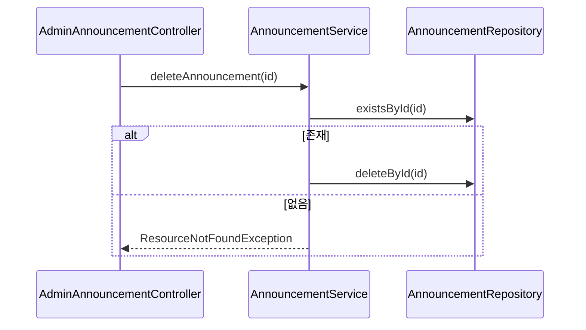

# 공지 삭제(관리자) 플로우

## 사전조건
- id가 필요하다.

## Mermaid 시퀀스 다이어그램

## 메모
- 실패 케이스: ResourceNotFoundException("Announcement not found")
- 관측: 코드로 확인 불가
- 트랜잭션: AnnouncementService.deleteAnnouncement은 쓰기 트랜잭션
