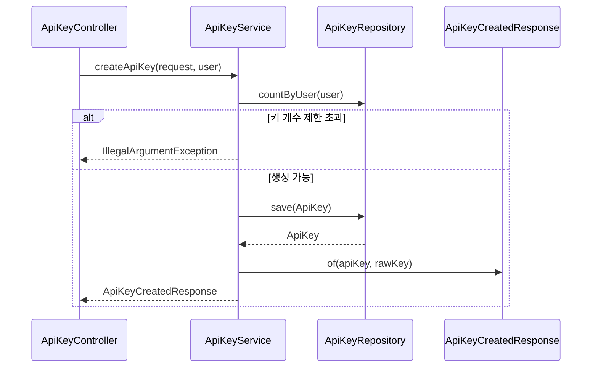

# API 키 생성 플로우

## 사전조건
- CreateApiKeyRequest가 전달된다.
- User 파라미터가 주입된다(@AuthenticationPrincipal).

## Mermaid 시퀀스 다이어그램

## 메모
- 실패 케이스: IllegalArgumentException(키 개수 제한), RuntimeException(SHA-256 미지원)
- 관측: 코드로 확인 불가
- 트랜잭션: ApiKeyService.createApiKey는 쓰기 트랜잭션
