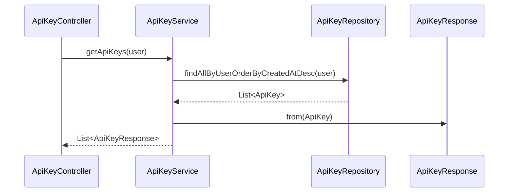

# API 키 목록 조회 플로우

## 사전조건
- User 파라미터가 주입된다(@AuthenticationPrincipal).

## Mermaid 시퀀스 다이어그램

```mermaid
sequenceDiagram
  participant ApiKeyController
  participant ApiKeyService
  participant ApiKeyRepository
  participant ApiKeyResponse
  ApiKeyController->>ApiKeyService: getApiKeys(user)
  ApiKeyService->>ApiKeyRepository: findAllByUserOrderByCreatedAtDesc(user)
  ApiKeyRepository-->>ApiKeyService: List<ApiKey>
  ApiKeyService->>ApiKeyResponse: from(ApiKey)
  ApiKeyService-->>ApiKeyController: List<ApiKeyResponse>
```

## 메모
- 실패 케이스: 코드로 확인 불가
- 관측: 코드로 확인 불가
- 트랜잭션: ApiKeyService.getApiKeys는 readOnly 트랜잭션
