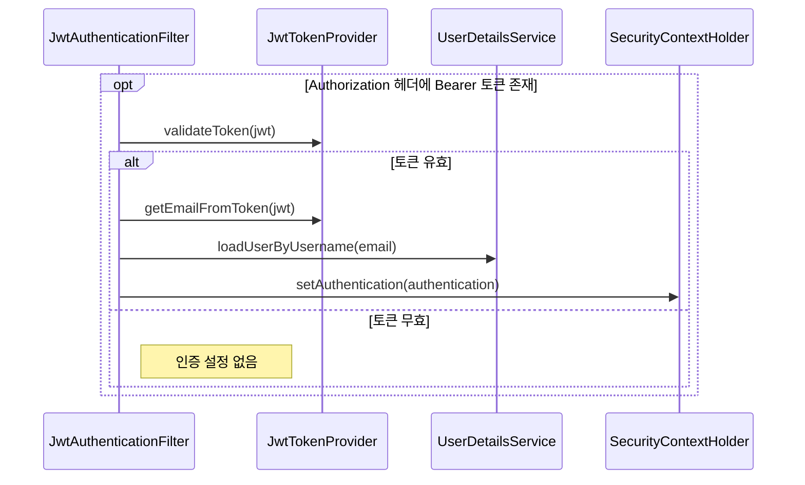

# 인증 필터 동작 플로우

## 사전조건
- Authorization 헤더가 Bearer 형식일 때 JWT 검증을 시도한다.

## Mermaid 시퀀스 다이어그램

## 메모
- 실패 케이스: 예외 발생 시 로그 기록 후 인증 미설정
- 관측: log.error("Could not set user authentication in security context", ex)
- 트랜잭션: 코드로 확인 불가
