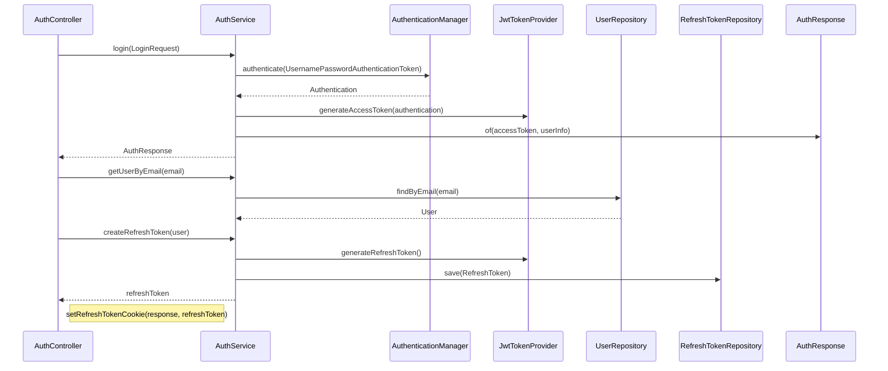

# 로그인 플로우

## 사전조건
- LoginRequest가 전달된다.

## Mermaid 시퀀스 다이어그램

## 메모
- 실패 케이스: BadCredentialsException("Invalid email or password"), ResourceNotFoundException("User not found")
- 관측: 코드로 확인 불가
- 트랜잭션: AuthService.login, AuthService.createRefreshToken는 쓰기 트랜잭션
