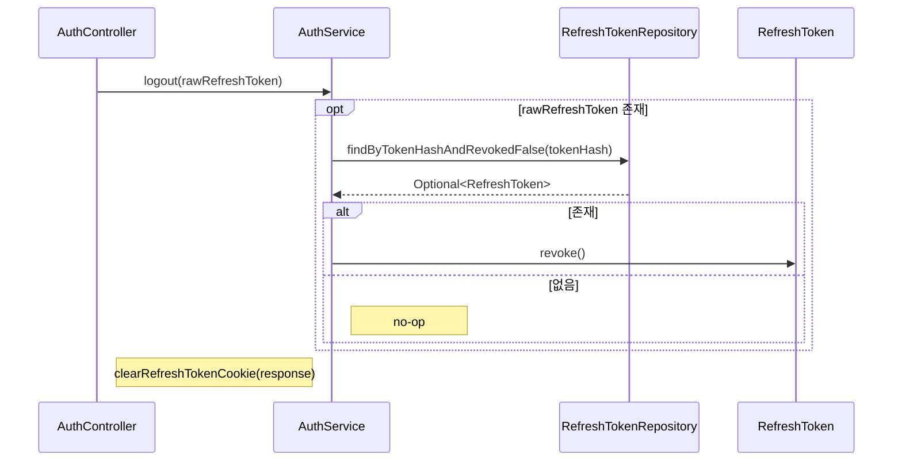

# 로그아웃 플로우

## 사전조건
- refreshToken 쿠키가 null이면 로그아웃 처리는 no-op이다.

## Mermaid 시퀀스 다이어그램

```mermaid
sequenceDiagram
  participant AuthController
  participant AuthService
  participant RefreshTokenRepository
  participant RefreshToken
  AuthController->>AuthService: logout(rawRefreshToken)
  opt rawRefreshToken 존재
    AuthService->>RefreshTokenRepository: findByTokenHashAndRevokedFalse(tokenHash)
    RefreshTokenRepository-->>AuthService: Optional<RefreshToken>
    alt 존재
      AuthService->>RefreshToken: revoke()
    else 없음
      Note right of AuthService: no-op
    end
  end
  Note right of AuthController: clearRefreshTokenCookie(response)
```

## 메모
- 실패 케이스: 코드로 확인 불가
- 관측: 코드로 확인 불가
- 트랜잭션: AuthService.logout은 쓰기 트랜잭션
