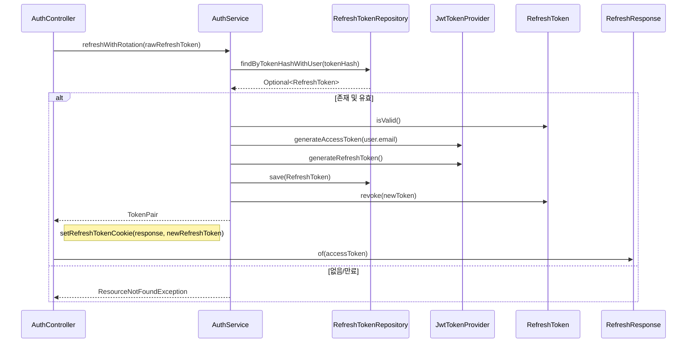

# 리프레시 토큰 갱신 플로우

## 사전조건
- refreshToken 쿠키가 없으면 401 응답을 반환한다.

## Mermaid 시퀀스 다이어그램

## 메모
- 실패 케이스: ResourceNotFoundException("Invalid or expired refresh token")
- 관측: 코드로 확인 불가
- 트랜잭션: AuthService.refreshWithRotation은 쓰기 트랜잭션
