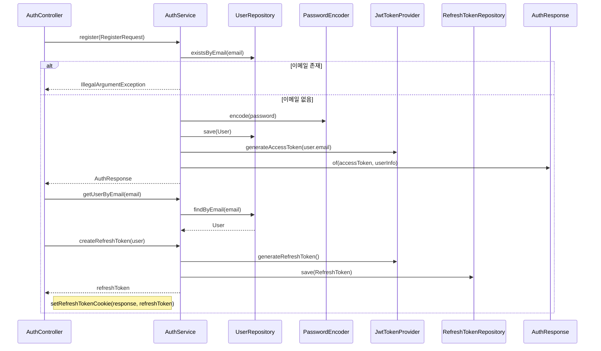

# 회원가입 플로우

## 사전조건
- RegisterRequest가 전달된다.

## Mermaid 시퀀스 다이어그램

## 메모
- 실패 케이스: IllegalArgumentException("Email already exists"), ResourceNotFoundException("User not found")
- 관측: 코드로 확인 불가
- 트랜잭션: AuthService.register, AuthService.createRefreshToken는 쓰기 트랜잭션
