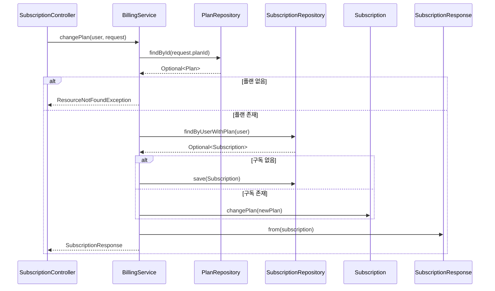

# 구독 플랜 변경 플로우

## 사전조건
- ChangePlanRequest가 전달된다.
- User 파라미터가 주입된다(@AuthenticationPrincipal).

## Mermaid 시퀀스 다이어그램

## 메모
- 실패 케이스: ResourceNotFoundException("Plan not found")
- 관측: 코드로 확인 불가
- 트랜잭션: BillingService.changePlan은 쓰기 트랜잭션
