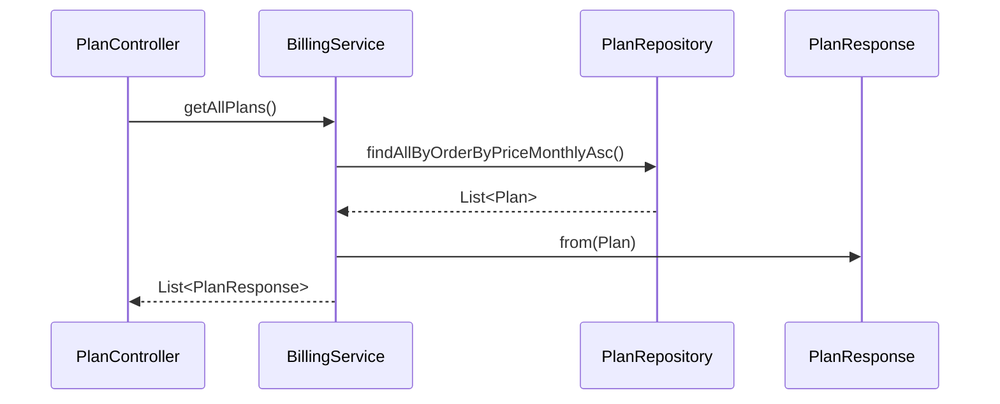

# 요금제 목록 조회 플로우

## 사전조건
- 없음

## Mermaid 시퀀스 다이어그램

```mermaid
sequenceDiagram
  participant PlanController
  participant BillingService
  participant PlanRepository
  participant PlanResponse
  PlanController->>BillingService: getAllPlans()
  BillingService->>PlanRepository: findAllByOrderByPriceMonthlyAsc()
  PlanRepository-->>BillingService: List<Plan>
  BillingService->>PlanResponse: from(Plan)
  BillingService-->>PlanController: List<PlanResponse>
```

## 메모
- 실패 케이스: 코드로 확인 불가
- 관측: 코드로 확인 불가
- 트랜잭션: BillingService.getAllPlans는 readOnly 트랜잭션
