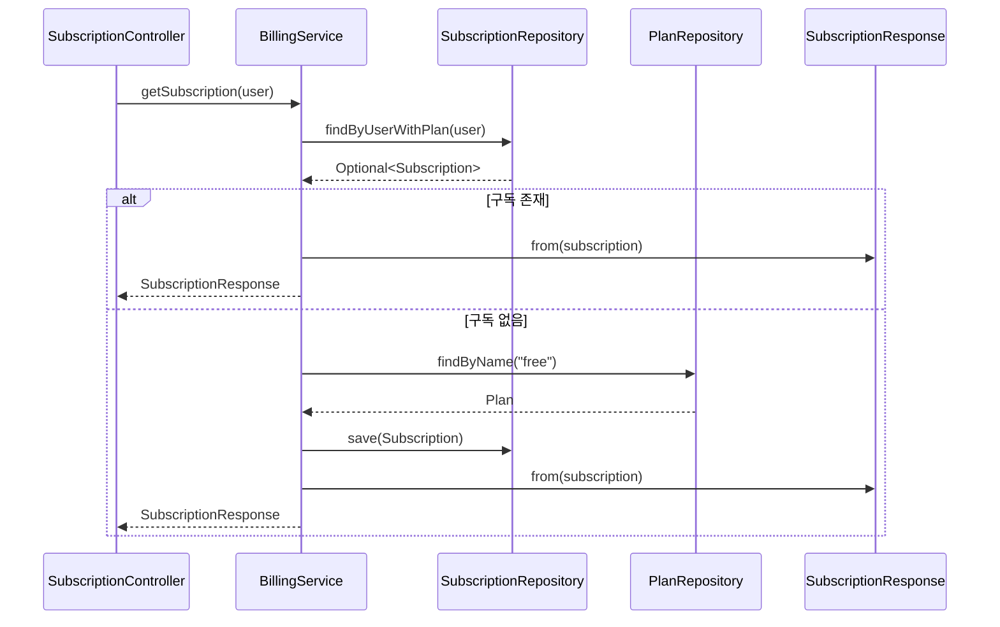

# 구독 조회 플로우

## 사전조건
- User 파라미터가 주입된다(@AuthenticationPrincipal).

## Mermaid 시퀀스 다이어그램

## 메모
- 실패 케이스: ResourceNotFoundException("Default plan not found")
- 관측: 코드로 확인 불가
- 트랜잭션: BillingService.getSubscription은 쓰기 트랜잭션
