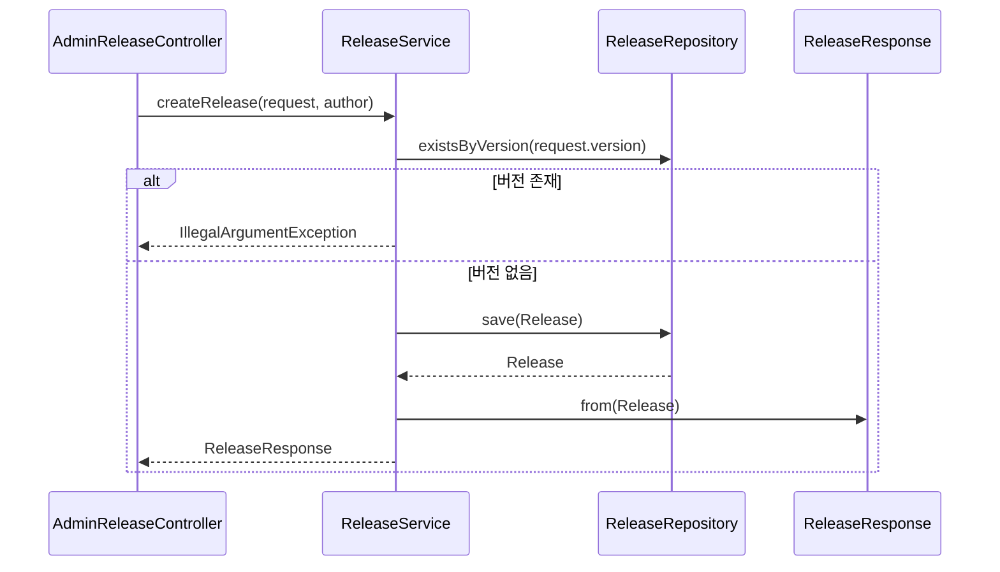

# 릴리스 생성(관리자) 플로우

## 사전조건
- CreateReleaseRequest가 전달된다.
- author(User) 파라미터가 주입된다(@AuthenticationPrincipal).

## Mermaid 시퀀스 다이어그램

## 메모
- 실패 케이스: IllegalArgumentException("Version already exists: ...")
- 관측: 코드로 확인 불가
- 트랜잭션: ReleaseService.createRelease는 쓰기 트랜잭션
