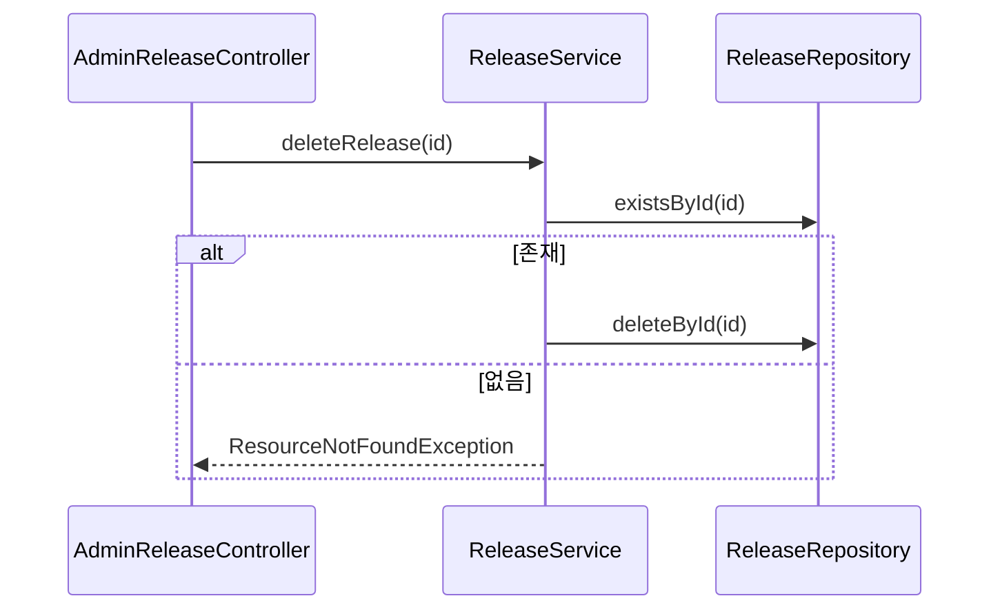

# 릴리스 삭제(관리자) 플로우

## 사전조건
- id가 필요하다.

## Mermaid 시퀀스 다이어그램

```mermaid
sequenceDiagram
  participant AdminReleaseController
  participant ReleaseService
  participant ReleaseRepository
  AdminReleaseController->>ReleaseService: deleteRelease(id)
  ReleaseService->>ReleaseRepository: existsById(id)
  alt 존재
    ReleaseService->>ReleaseRepository: deleteById(id)
  else 없음
    ReleaseService-->>AdminReleaseController: ResourceNotFoundException
  end
```

## 메모
- 실패 케이스: ResourceNotFoundException("Release not found")
- 관측: 코드로 확인 불가
- 트랜잭션: ReleaseService.deleteRelease는 쓰기 트랜잭션
