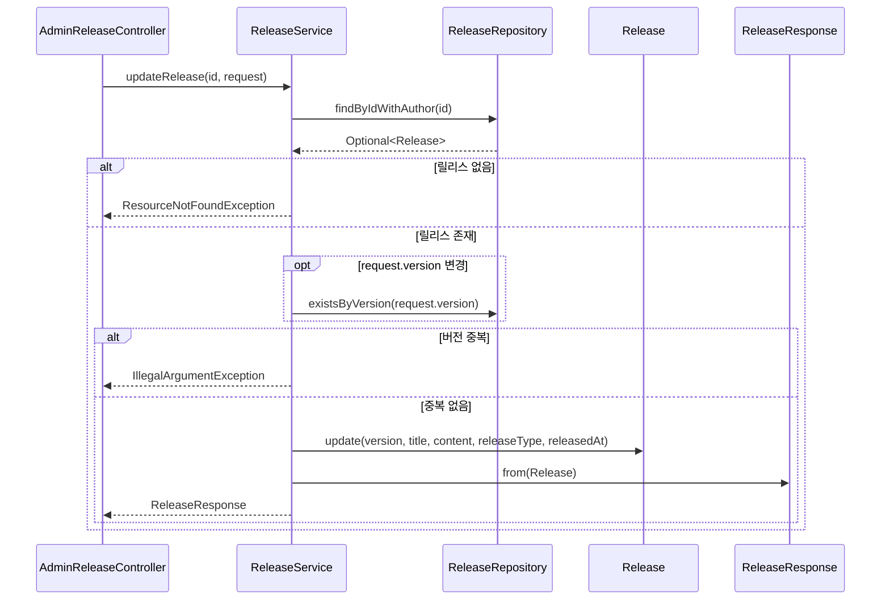

# 릴리스 수정(관리자) 플로우

## 사전조건
- id와 UpdateReleaseRequest가 전달된다.

## Mermaid 시퀀스 다이어그램

## 메모
- 실패 케이스: ResourceNotFoundException("Release not found"), IllegalArgumentException("Version already exists: ...")
- 관측: 코드로 확인 불가
- 트랜잭션: ReleaseService.updateRelease는 쓰기 트랜잭션
