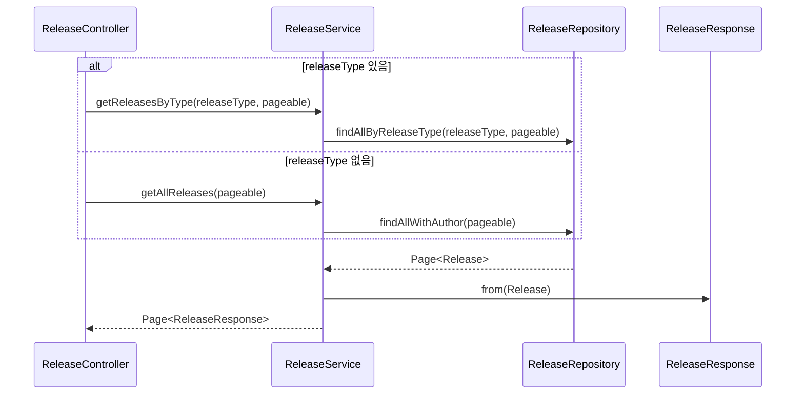

# 릴리스 목록 조회 플로우

## 사전조건
- releaseType은 선택 입력이다.
- pageable 파라미터가 전달될 수 있다.

## Mermaid 시퀀스 다이어그램

## 메모
- 실패 케이스: 코드로 확인 불가
- 관측: 코드로 확인 불가
- 트랜잭션: ReleaseService.getAllReleases, getReleasesByType는 readOnly 트랜잭션
