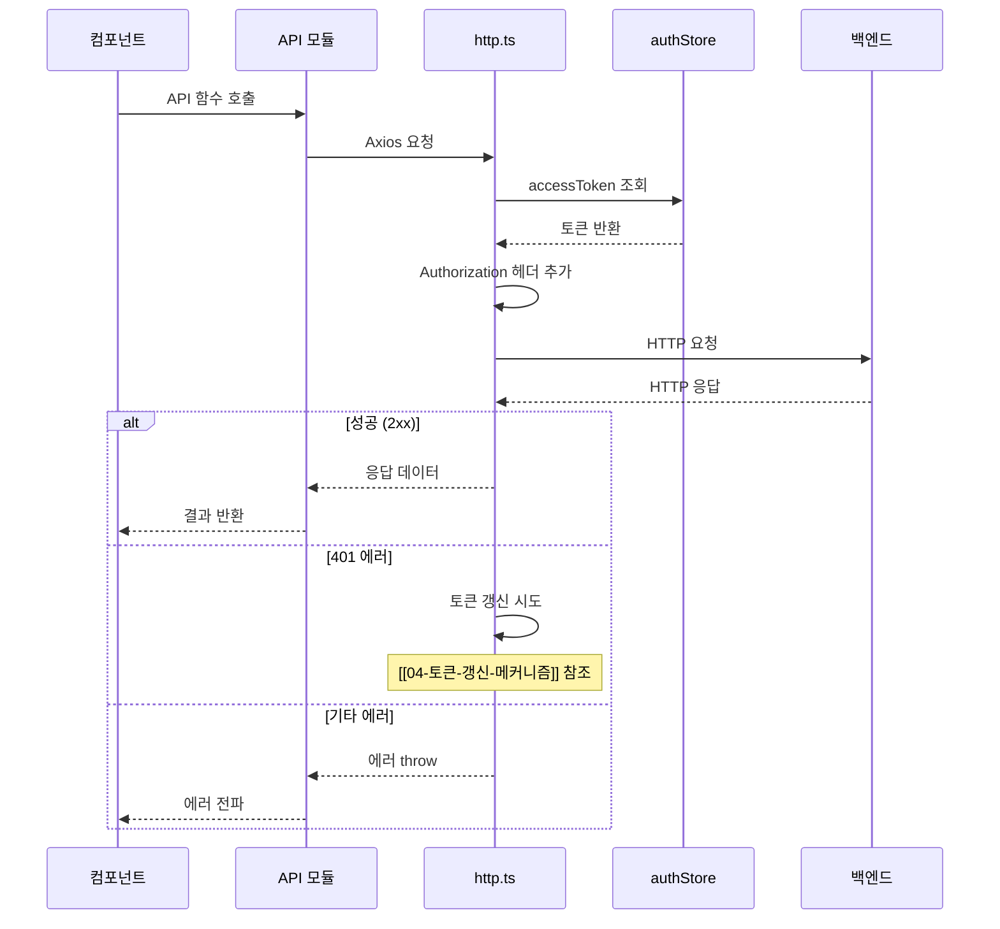

# API 모듈

## 개요

`src/api/` 디렉토리에는 백엔드 API와 통신하는 모듈들이 있습니다. Axios를 기반으로 하며, 인터셉터를 통해 인증 토큰 관리와 에러 처리를 수행합니다.

## HTTP 클라이언트 (http.ts)

### Axios 인스턴스 설정

```typescript
const http = axios.create({
  baseURL: '/api/v1',
  timeout: 30000,  // 30초
  withCredentials: true  // 쿠키 자동 전송
})
```

### 요청 인터셉터

모든 요청에 인증 토큰을 자동으로 추가합니다.

```typescript
http.interceptors.request.use((config) => {
  const authStore = useAuthStore()
  if (authStore.accessToken) {
    config.headers.Authorization = `Bearer ${authStore.accessToken}`
  }
  return config
})
```

### 응답 인터셉터

401 에러 발생 시 토큰 갱신을 자동으로 처리합니다.

자세한 내용: [[04-토큰-갱신-메커니즘]]

## API 모듈 상세

### auth.ts - 인증 API

| 함수 | HTTP 메서드 | 엔드포인트 | 설명 |
|------|------------|-----------|------|
| `login(email, password)` | POST | `/auth/login` | 로그인 |
| `register(name, email, password)` | POST | `/auth/register` | 회원가입 |
| `logout()` | POST | `/auth/logout` | 로그아웃 |
| `refresh()` | POST | `/auth/refresh` | 토큰 갱신 |
| `getCurrentUser()` | GET | `/auth/me` | 현재 사용자 정보 |

#### 응답 타입

```typescript
// 로그인/회원가입 응답
interface AuthResponse {
  accessToken: string
  user: {
    id: number
    email: string
    nickname: string
    role: string  // 'ROLE_USER' | 'ROLE_ADMIN'
  }
}

// 토큰 갱신 응답
interface RefreshResponse {
  accessToken: string
}
```

### announcements.ts - 공지사항 API

#### 공개 API

| 함수 | HTTP 메서드 | 엔드포인트 | 설명 |
|------|------------|-----------|------|
| `getAnnouncements(params?)` | GET | `/announcements` | 공지사항 목록 조회 |
| `getAnnouncement(id)` | GET | `/announcements/:id` | 공지사항 상세 조회 |
| `getLatestAnnouncements(limit)` | GET | `/announcements/latest` | 최신 공지사항 조회 |

#### 관리자 API

| 함수 | HTTP 메서드 | 엔드포인트 | 설명 |
|------|------------|-----------|------|
| `createAnnouncement(data)` | POST | `/admin/announcements` | 공지사항 생성 |
| `updateAnnouncement(id, data)` | PUT | `/admin/announcements/:id` | 공지사항 수정 |
| `deleteAnnouncement(id)` | DELETE | `/admin/announcements/:id` | 공지사항 삭제 |

#### 요청/응답 타입

```typescript
// 페이징 요청
interface PageParams {
  page?: number
  size?: number
  sort?: string
}

// 페이징 응답
interface PageResponse<T> {
  content: T[]
  totalElements: number
  totalPages: number
  page: number
  size: number
}

// 공지사항
interface Announcement {
  id: number
  title: string
  content: string
  category: string  // 'NOTICE' | 'UPDATE' | 'EVENT' | 'MAINTENANCE'
  pinned: boolean
  createdAt: string
  updatedAt: string
}
```

### releases.ts - 릴리스 API

#### 공개 API

| 함수 | HTTP 메서드 | 엔드포인트 | 설명 |
|------|------------|-----------|------|
| `getReleases(params?)` | GET | `/releases` | 릴리스 목록 조회 |
| `getRelease(id)` | GET | `/releases/:id` | 릴리스 상세 조회 |
| `getLatestReleases(limit)` | GET | `/releases/latest` | 최신 릴리스 조회 |

#### 관리자 API

| 함수 | HTTP 메서드 | 엔드포인트 | 설명 |
|------|------------|-----------|------|
| `createRelease(data)` | POST | `/admin/releases` | 릴리스 생성 |
| `updateRelease(id, data)` | PUT | `/admin/releases/:id` | 릴리스 수정 |
| `deleteRelease(id)` | DELETE | `/admin/releases/:id` | 릴리스 삭제 |

#### 날짜 변환

릴리스 생성/수정 시 `releasedAt` 필드를 ISO 형식으로 변환합니다.

```typescript
// 프론트엔드 입력 형식
const data = { releasedAt: '2024-01-15' }

// 백엔드 전송 형식
toLocalDateTime(data.releasedAt)  // '2024-01-15T00:00:00'
```

### apikeys.ts - API 키 관리 API

| 함수 | HTTP 메서드 | 엔드포인트 | 설명 |
|------|------------|-----------|------|
| `getApiKeys()` | GET | `/apikeys` | API 키 목록 조회 |
| `createApiKey(name, expiresAt?)` | POST | `/apikeys` | API 키 생성 |
| `deleteApiKey(id)` | DELETE | `/apikeys/:id` | API 키 삭제 |
| `regenerateApiKey(id)` | POST | `/apikeys/:id/regenerate` | API 키 재생성 |

#### API 키 타입

```typescript
interface ApiKey {
  id: number
  name: string
  key: string         // 생성/재생성 시에만 반환
  maskedKey: string   // 목록 조회 시 마스킹된 키
  expiresAt?: string
  lastUsedAt?: string
  createdAt: string
}
```

### subscription.ts - 구독/사용량 API

| 함수 | HTTP 메서드 | 엔드포인트 | 설명 |
|------|------------|-----------|------|
| `getCurrentSubscription()` | GET | `/subscription/current` | 현재 구독 정보 |
| `getUsageStats()` | GET | `/subscription/usage` | 사용량 통계 |

#### 사용량 통계 타입

```typescript
interface UsageStats {
  requestsToday: number
  requestsThisMonth: number
  dailyLimit: number
  monthlyLimit: number
}
```

### plans.ts - 플랜 API

| 함수 | HTTP 메서드 | 엔드포인트 | 설명 |
|------|------------|-----------|------|
| `getPlans()` | GET | `/plans` | 플랜 목록 조회 |
| `getPlan(id)` | GET | `/plans/:id` | 플랜 상세 조회 |

## 에러 처리

### API 에러 응답 구조

```typescript
interface ApiError {
  status: number
  message: string
  errors?: FieldError[]
}

interface FieldError {
  field: string
  message: string
}
```

### 에러 처리 패턴

```typescript
try {
  const response = await authApi.login(email, password)
  // 성공 처리
} catch (error) {
  if (axios.isAxiosError(error)) {
    const message = error.response?.data?.message || '오류가 발생했습니다'
    toast.error(message)
  }
}
```

## API 호출 흐름도



## 관련 문서

- [[04-토큰-갱신-메커니즘]] - 401 응답 처리 상세
- [[05-상태관리-Pinia]] - authStore의 토큰 관리
- [[08-인증-프로세스]] - 로그인/로그아웃 전체 흐름
