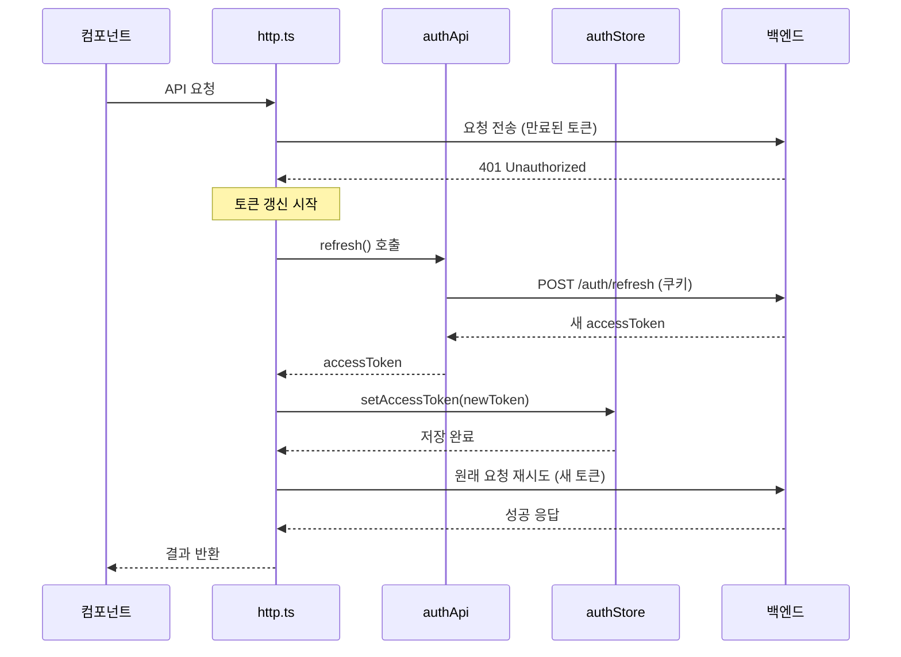
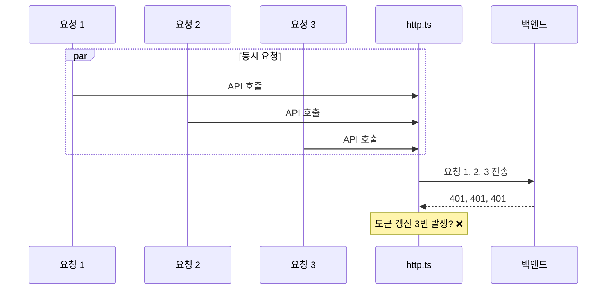
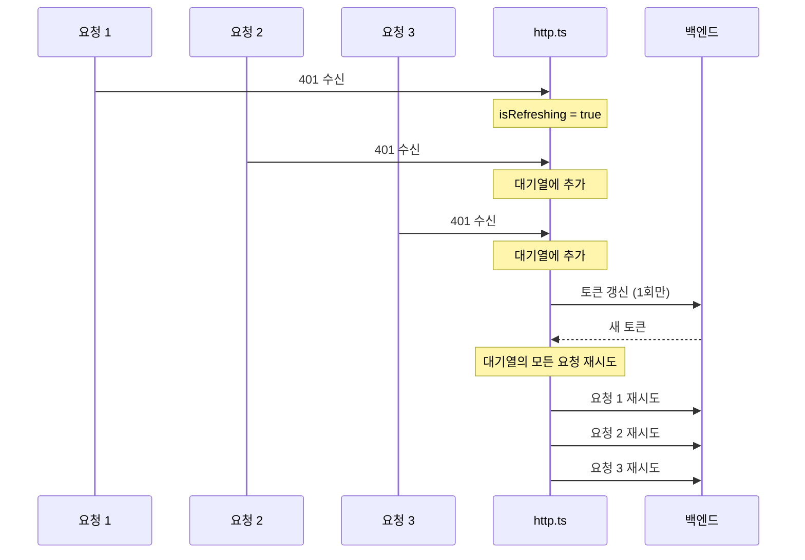
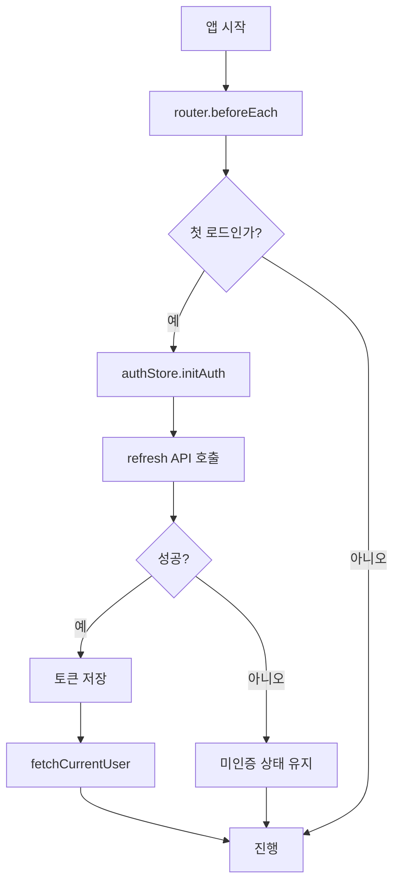

# 토큰 갱신 메커니즘

## 개요

JWT 토큰 만료 시 사용자 경험을 해치지 않으면서 자동으로 토큰을 갱신하는 메커니즘입니다. Axios 응답 인터셉터에서 401 에러를 감지하고 토큰 갱신을 수행합니다.

## 토큰 저장 전략

| 토큰 유형 | 저장 위치 | 보안 특성 |
|---------|----------|----------|
| Access Token | 메모리 (Pinia Store) | XSS 공격에 상대적으로 안전 |
| Refresh Token | HttpOnly 쿠키 | JavaScript 접근 불가 |

### 왜 localStorage를 사용하지 않는가?

- localStorage는 XSS 공격에 취약
- 메모리 저장 시 페이지 새로고침 시 토큰 손실
- 이를 보완하기 위해 앱 초기화 시 토큰 갱신 시도

## 자동 토큰 갱신 흐름

### 시퀀스 다이어그램



### 구현 상세

```typescript
// http.ts 응답 인터셉터
http.interceptors.response.use(
  (response) => response,
  async (error) => {
    const originalRequest = error.config

    // 401 에러이고, 재시도하지 않은 요청인 경우
    if (error.response?.status === 401 && !originalRequest._retry) {
      // 이미 갱신 중인 경우
      if (isRefreshing) {
        // 대기열에 추가
        return new Promise((resolve, reject) => {
          refreshSubscribers.push({
            resolve,
            reject,
            config: originalRequest
          })
        })
      }

      originalRequest._retry = true
      isRefreshing = true

      try {
        // 토큰 갱신
        const response = await authApi.refresh()
        const authStore = useAuthStore()
        authStore.setAccessToken(response.accessToken)

        // 대기 중인 요청들 처리
        refreshSubscribers.forEach((subscriber) => {
          subscriber.resolve(http(subscriber.config))
        })
        refreshSubscribers = []

        // 원래 요청 재시도
        return http(originalRequest)
      } catch (refreshError) {
        // 갱신 실패 시 로그아웃
        const authStore = useAuthStore()
        authStore.logout()

        // 대기 중인 요청들 거부
        refreshSubscribers.forEach((subscriber) => {
          subscriber.reject(refreshError)
        })
        refreshSubscribers = []

        // 로그인 페이지로 리다이렉트
        window.location.href = '/login'
        return Promise.reject(refreshError)
      } finally {
        isRefreshing = false
      }
    }

    return Promise.reject(error)
  }
)
```

## 동시 요청 처리

여러 API 요청이 동시에 401 에러를 받을 때, 토큰 갱신이 한 번만 수행되도록 합니다.

### 문제 상황



### 해결 방법: 구독자 패턴



### 핵심 변수

```typescript
let isRefreshing = false  // 갱신 진행 중 플래그
let refreshSubscribers: RefreshSubscriber[] = []  // 대기 중인 요청들

interface RefreshSubscriber {
  resolve: (value: any) => void
  reject: (error: any) => void
  config: AxiosRequestConfig
}
```

## 앱 초기화 시 토큰 복구

페이지 새로고침 시 메모리의 토큰이 손실되므로, 앱 시작 시 토큰 갱신을 시도합니다.

### 흐름도



### 구현

```typescript
// stores/auth.ts
async initAuth() {
  if (this.isInitialized) return

  try {
    const response = await authApi.refresh()
    this.accessToken = response.accessToken
    await this.fetchCurrentUser()
  } catch (error) {
    // 갱신 실패 = 로그인 필요
    this.accessToken = null
    this.user = null
  } finally {
    this.isInitialized = true
  }
}
```

## 갱신 실패 처리

### 실패 원인

1. Refresh Token 만료
2. Refresh Token 무효화 (로그아웃, 비밀번호 변경 등)
3. 네트워크 오류

### 처리 방법

```mermaid
flowchart TD
    A[토큰 갱신 실패] --> B[authStore.logout]
    B --> C[accessToken = null]
    C --> D[user = null]
    D --> E[/login으로 리다이렉트]
```

## 보안 고려사항

1. **HttpOnly 쿠키**: Refresh Token은 JavaScript로 접근 불가
2. **CSRF 방지**: SameSite 쿠키 속성 사용 (백엔드 설정)
3. **토큰 갱신 시 기존 토큰 무효화**: 백엔드에서 처리 (코드로 확인 불가)

## 관련 문서

- [[03-API-모듈]] - HTTP 클라이언트 설정
- [[05-상태관리-Pinia]] - authStore 구조
- [[08-인증-프로세스]] - 전체 인증 흐름
