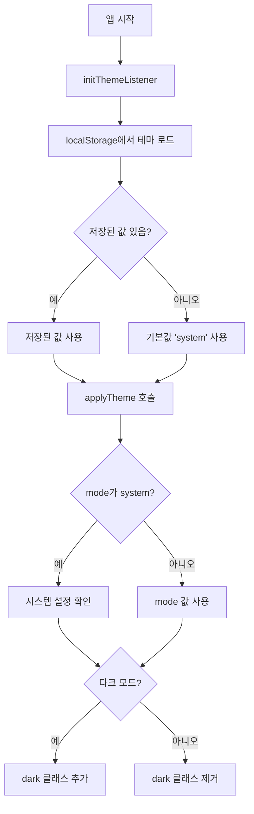
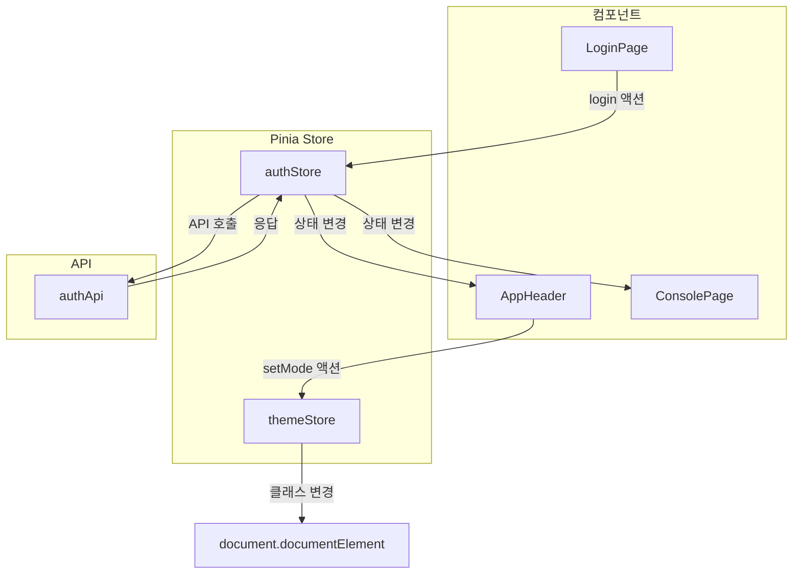

# 상태 관리 (Pinia)

## 개요

Pinia를 사용하여 전역 상태를 관리합니다. Vue 3의 Composition API와 자연스럽게 통합되며, TypeScript 지원이 우수합니다.

## Store 구조

```
src/stores/
├── index.ts      # Store export
├── auth.ts       # 인증 상태
└── theme.ts      # 테마 상태
```

## Auth Store (auth.ts)

사용자 인증 상태와 관련 로직을 관리합니다.

### State

```typescript
interface AuthState {
  accessToken: string | null  // JWT 액세스 토큰
  user: User | null          // 현재 로그인한 사용자 정보
  isLoading: boolean         // 로딩 상태
  error: string | null       // 에러 메시지
  isInitialized: boolean     // 초기화 완료 여부
}

interface User {
  id: number
  email: string
  nickname: string
  role: string  // 'ROLE_USER' | 'ROLE_ADMIN'
}
```

### Getters (Computed)

| Getter | 타입 | 설명 |
|--------|------|------|
| `isAuthenticated` | boolean | 로그인 여부 (accessToken 존재 여부) |
| `isAdmin` | boolean | 관리자 여부 (role === 'ROLE_ADMIN') |

### Actions

#### `login(email: string, password: string)`

로그인을 수행합니다.

```typescript
async login(email: string, password: string) {
  this.isLoading = true
  this.error = null

  try {
    const response = await authApi.login(email, password)
    this.accessToken = response.accessToken
    this.user = response.user
  } catch (error) {
    this.error = error.response?.data?.message || '로그인 실패'
    throw error
  } finally {
    this.isLoading = false
  }
}
```

#### `register(name: string, email: string, password: string)`

회원가입을 수행합니다.

```typescript
async register(name: string, email: string, password: string) {
  this.isLoading = true
  this.error = null

  try {
    const response = await authApi.register(name, email, password)
    this.accessToken = response.accessToken
    this.user = response.user
  } catch (error) {
    this.error = error.response?.data?.message || '회원가입 실패'
    throw error
  } finally {
    this.isLoading = false
  }
}
```

#### `logout()`

로그아웃을 수행합니다.

```typescript
async logout() {
  try {
    await authApi.logout()
  } catch (error) {
    // 실패해도 로컬 상태는 정리
  } finally {
    this.accessToken = null
    this.user = null
  }
}
```

#### `initAuth()`

앱 시작 시 인증 상태를 복구합니다.

```typescript
async initAuth() {
  if (this.isInitialized) return

  try {
    const response = await authApi.refresh()
    this.accessToken = response.accessToken
    await this.fetchCurrentUser()
  } catch (error) {
    // 갱신 실패 = 미인증 상태
    this.accessToken = null
    this.user = null
  } finally {
    this.isInitialized = true
  }
}
```

#### `fetchCurrentUser()`

현재 사용자 정보를 조회합니다.

```typescript
async fetchCurrentUser() {
  try {
    this.user = await authApi.getCurrentUser()
  } catch (error) {
    this.user = null
    throw error
  }
}
```

#### `setAccessToken(token: string)`

액세스 토큰을 설정합니다 (토큰 갱신 시 사용).

```typescript
setAccessToken(token: string) {
  this.accessToken = token
}
```

### 사용 예시

```typescript
// 컴포넌트에서 사용
import { useAuthStore } from '@/stores/auth'

const authStore = useAuthStore()

// 상태 접근
console.log(authStore.isAuthenticated)
console.log(authStore.user?.nickname)

// 액션 호출
await authStore.login('user@example.com', 'password')
```

## Theme Store (theme.ts)

테마 상태를 관리합니다.

### State

```typescript
interface ThemeState {
  mode: 'light' | 'dark' | 'system'
}
```

### Actions

#### `setMode(mode: 'light' | 'dark' | 'system')`

테마 모드를 설정합니다.

```typescript
setMode(mode: 'light' | 'dark' | 'system') {
  this.mode = mode
  localStorage.setItem('theme', mode)
  this.applyTheme()
}
```

#### `applyTheme()`

현재 모드에 따라 테마를 적용합니다.

```typescript
applyTheme() {
  let isDark = false

  if (this.mode === 'system') {
    isDark = window.matchMedia('(prefers-color-scheme: dark)').matches
  } else {
    isDark = this.mode === 'dark'
  }

  if (isDark) {
    document.documentElement.classList.add('dark')
  } else {
    document.documentElement.classList.remove('dark')
  }
}
```

#### `initThemeListener()`

시스템 테마 변경을 감지합니다.

```typescript
initThemeListener() {
  // localStorage에서 저장된 테마 로드
  const saved = localStorage.getItem('theme') as ThemeMode | null
  if (saved) {
    this.mode = saved
  }

  // 시스템 테마 변경 감지
  window.matchMedia('(prefers-color-scheme: dark)')
    .addEventListener('change', () => {
      if (this.mode === 'system') {
        this.applyTheme()
      }
    })

  this.applyTheme()
}
```

### 테마 적용 흐름



### 사용 예시

```typescript
import { useThemeStore } from '@/stores/theme'

const themeStore = useThemeStore()

// 테마 변경
themeStore.setMode('dark')

// 현재 테마 확인
console.log(themeStore.mode)  // 'dark'
```

## Store 상태 흐름도



## 관련 문서

- [[03-API-모듈]] - API 호출
- [[04-토큰-갱신-메커니즘]] - 토큰 관리
- [[08-인증-프로세스]] - 인증 전체 흐름
