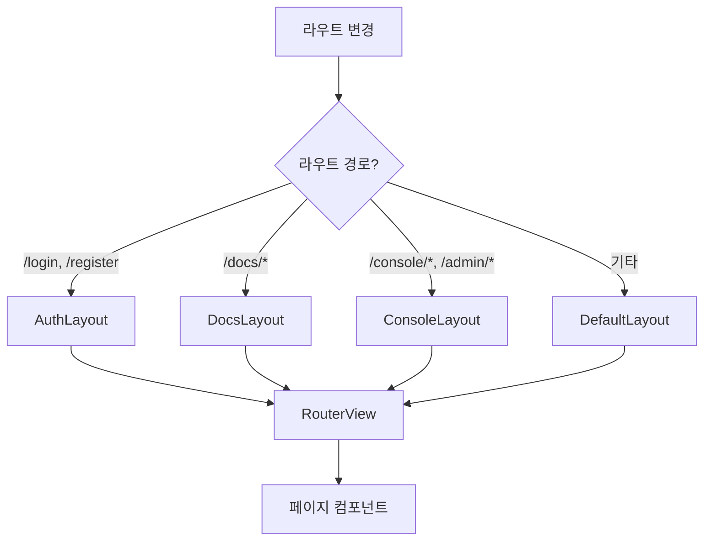

# 레이아웃 컴포넌트

## 개요

레이아웃 컴포넌트는 페이지의 전체적인 구조를 정의합니다. 각 레이아웃은 특정 유형의 페이지에 맞게 설계되어 있습니다.

## 레이아웃 목록

```
src/layouts/
├── DefaultLayout.vue   # 기본 레이아웃
├── AuthLayout.vue      # 인증 페이지 레이아웃
├── DocsLayout.vue      # 문서 페이지 레이아웃
├── ConsoleLayout.vue   # 콘솔 페이지 레이아웃
└── AdminLayout.vue     # 관리자 레이아웃
```

## DefaultLayout.vue

일반적인 공개 페이지에 사용되는 기본 레이아웃입니다.

### 구조

```
┌─────────────────────────────────────────┐
│              AppHeader                   │
├─────────────────────────────────────────┤
│                                          │
│                                          │
│             <RouterView />               │
│                                          │
│                                          │
├─────────────────────────────────────────┤
│              AppFooter                   │
└─────────────────────────────────────────┘
```

### 사용 페이지

- HomePage
- PricingPage
- CommunityPage
- ReleasesPage / ReleaseDetailPage
- AnnouncementsPage / AnnouncementDetailPage
- SearchPage
- ApiDocsPage

### 구성 요소

| 요소 | 설명 |
|------|------|
| AppHeader | 네비게이션 헤더 (로고, 메뉴, 사용자 정보) |
| RouterView | 페이지 컴포넌트 렌더링 영역 |
| AppFooter | 푸터 (링크, 저작권) |

## AuthLayout.vue

로그인, 회원가입 페이지에 사용되는 레이아웃입니다.

### 구조

```
┌─────────────────────────────────────────┐
│                                          │
│                                          │
│    ┌─────────────────────────────┐      │
│    │                              │      │
│    │        <RouterView />        │      │
│    │        (중앙 정렬 폼)         │      │
│    │                              │      │
│    └─────────────────────────────┘      │
│                                          │
│                                          │
└─────────────────────────────────────────┘
```

### 사용 페이지

- LoginPage
- RegisterPage

### 특징

- 전체 화면 중앙 정렬
- 배경 그라데이션 또는 단색
- 헤더/푸터 없음 (간결한 인증 화면)

## DocsLayout.vue

기술 문서 페이지에 사용되는 3단 레이아웃입니다.

### 구조

```
┌─────────────────────────────────────────────────────┐
│                      AppHeader                       │
├──────────┬─────────────────────────────┬────────────┤
│          │                              │            │
│          │                              │            │
│   Docs   │                              │    TOC     │
│  Sidebar │       <RouterView />         │  (목차)    │
│  (네비)  │       (문서 콘텐츠)           │            │
│          │                              │            │
│          │                              │            │
├──────────┴─────────────────────────────┴────────────┤
│                      AppFooter                       │
└─────────────────────────────────────────────────────┘
```

### 사용 페이지

- DocsIndexPage
- DocsSlugPage

### 구성 요소

| 요소 | 위치 | 설명 |
|------|------|------|
| AppHeader | 상단 | 네비게이션 헤더 |
| DocsSidebar | 좌측 | 문서 목록 및 섹션 네비게이션 |
| RouterView | 중앙 | 문서 콘텐츠 |
| DocsToc | 우측 | 현재 문서의 목차 (Table of Contents) |
| AppFooter | 하단 | 푸터 |

### 반응형 동작

| 화면 크기 | 사이드바 | TOC |
|----------|---------|-----|
| 데스크톱 (>= 1024px) | 고정 표시 | 고정 표시 |
| 태블릿 (768px ~ 1024px) | 토글 버튼 | 숨김 |
| 모바일 (< 768px) | 토글 버튼 | 숨김 |

## ConsoleLayout.vue

인증된 사용자의 대시보드 페이지에 사용됩니다.

### 구조

```
┌─────────────────────────────────────────────────────┐
│                  상단 네비게이션 바                   │
├──────────┬──────────────────────────────────────────┤
│          │                                           │
│   좌측   │                                           │
│   네비   │          <RouterView />                   │
│  게이션  │          (콘솔 콘텐츠)                     │
│          │                                           │
│          │                                           │
│          │                                           │
└──────────┴──────────────────────────────────────────┘
```

### 사용 페이지

- ConsolePage (대시보드)
- ConsoleApiKeysPage (API 키 관리)
- ConsoleBillingPage (결제 관리)
- AdminAnnouncementsPage (관리자)
- AdminReleasesPage (관리자)

### 좌측 네비게이션 메뉴

```typescript
const consoleMenu = [
  { name: 'Dashboard', path: '/console', icon: HomeIcon },
  { name: 'API Keys', path: '/console/api-keys', icon: KeyIcon },
  { name: 'Billing', path: '/console/billing', icon: CreditCardIcon }
]

// 관리자 전용 메뉴 (authStore.isAdmin인 경우)
const adminMenu = [
  { name: 'Announcements', path: '/admin/announcements', icon: MegaphoneIcon },
  { name: 'Releases', path: '/admin/releases', icon: RocketIcon }
]
```

### 특징

- 좌측 사이드바 고정
- 상단 네비게이션에 사용자 정보 표시
- 현재 활성 메뉴 하이라이트
- 관리자 메뉴 조건부 표시

## AdminLayout.vue

(코드로 확인 불가 - 현재 ConsoleLayout을 공유하여 사용하는 것으로 추정)

## 레이아웃 적용 방식

라우터에서 레이아웃을 지정합니다.

```typescript
// router/index.ts
{
  path: '/',
  component: DefaultLayout,
  children: [
    { path: '', component: () => import('@/pages/HomePage.vue') }
  ]
}

{
  path: '/login',
  component: AuthLayout,
  children: [
    { path: '', component: () => import('@/pages/auth/LoginPage.vue') }
  ]
}

{
  path: '/docs',
  component: DocsLayout,
  children: [
    { path: '', component: () => import('@/pages/docs/DocsIndexPage.vue') },
    { path: ':slug', component: () => import('@/pages/docs/DocsSlugPage.vue') }
  ]
}

{
  path: '/console',
  component: ConsoleLayout,
  meta: { requiresAuth: true },
  children: [
    { path: '', component: () => import('@/pages/console/ConsolePage.vue') }
  ]
}
```

## 레이아웃 흐름도



## 관련 문서

- [[02-라우팅-시스템]] - 라우트와 레이아웃 매핑
- [[07-공통-컴포넌트]] - AppHeader, AppFooter 등
