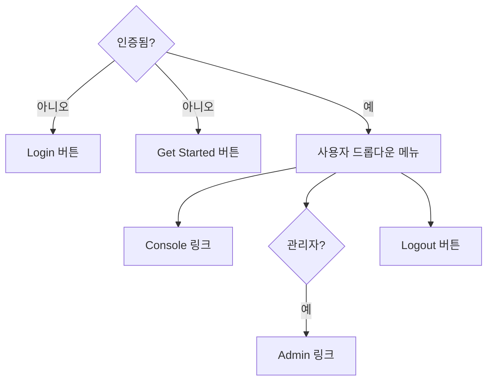
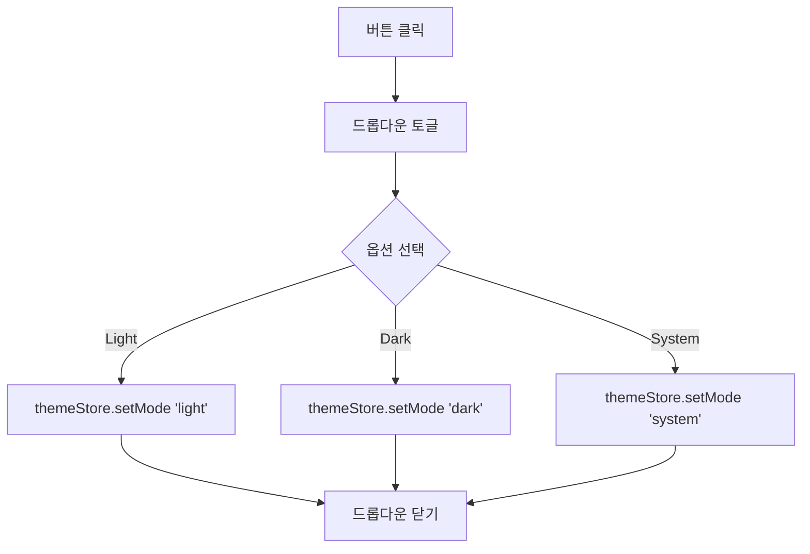
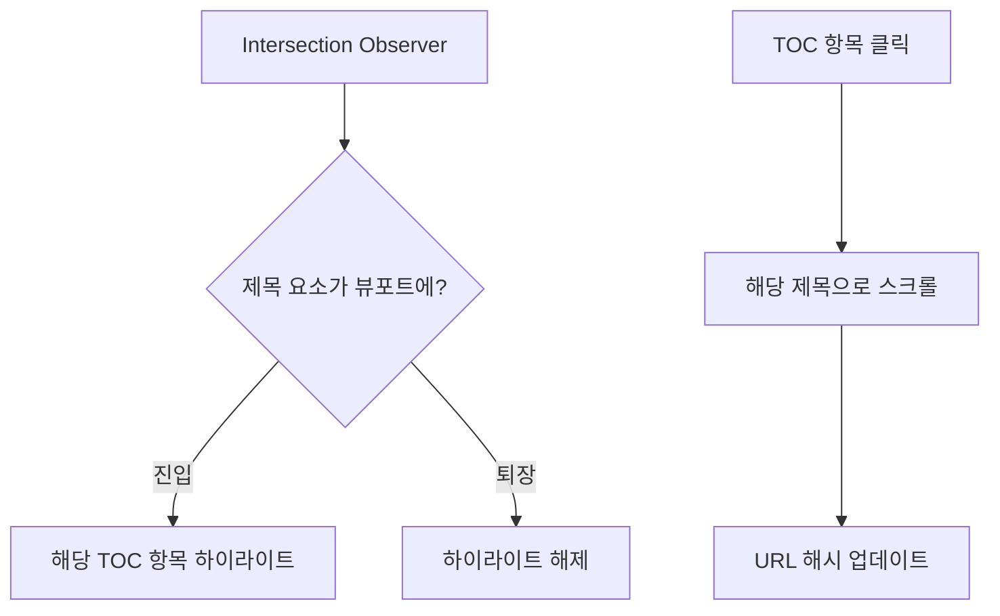
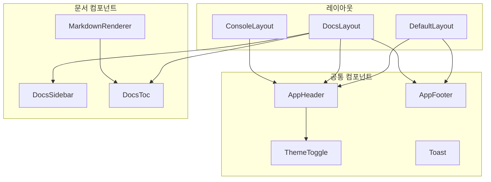

# 공통 컴포넌트

## 개요

재사용 가능한 UI 컴포넌트들입니다. 여러 페이지에서 공통으로 사용됩니다.

## 컴포넌트 목록

```
src/components/
├── AppHeader.vue        # 네비게이션 헤더
├── AppFooter.vue        # 푸터
├── ThemeToggle.vue      # 테마 전환 버튼
├── Toast.vue            # 토스트 알림
├── MarkdownRenderer.vue # 마크다운 렌더러
├── DocsSidebar.vue      # 문서 사이드바
└── DocsToc.vue          # 목차 (TOC)
```

## AppHeader.vue

전체 사이트의 네비게이션 헤더입니다.

### 구조

```
┌─────────────────────────────────────────────────────────────────┐
│ [Logo]  Docs  API  Releases  Pricing  Community  [검색] [테마] [사용자]│
└─────────────────────────────────────────────────────────────────┘
```

### 기능

| 기능 | 설명 |
|------|------|
| 로고 | 클릭 시 홈페이지(`/`)로 이동 |
| 네비게이션 메뉴 | 주요 페이지 링크 |
| 검색 버튼 | `/search` 페이지로 이동 |
| 테마 토글 | ThemeToggle 컴포넌트 |
| 사용자 메뉴 | 인증 상태에 따라 다르게 표시 |

### 사용자 메뉴 상태



### 모바일 메뉴

작은 화면에서는 햄버거 메뉴로 전환됩니다.

- 768px 미만: 모바일 메뉴 활성화
- 클릭 시 전체 화면 오버레이 메뉴 표시

## AppFooter.vue

페이지 하단의 푸터입니다.

### 구조

```
┌─────────────────────────────────────────────────────────────────┐
│  Product        Resources       Company        Legal            │
│  - Features     - Docs          - About        - Privacy        │
│  - Pricing      - API           - Blog         - Terms          │
│  - Changelog    - Community     - Contact      - Cookies        │
├─────────────────────────────────────────────────────────────────┤
│               © 2024 DevAPI. All rights reserved.               │
└─────────────────────────────────────────────────────────────────┘
```

## ThemeToggle.vue

다크/라이트 모드를 전환하는 버튼입니다.

### Props

없음

### 동작



### 아이콘

| 모드 | 아이콘 |
|------|--------|
| Light | SunIcon |
| Dark | MoonIcon |
| System | ComputerDesktopIcon |

## Toast.vue

알림 메시지를 표시하는 토스트 컴포넌트입니다.

### 특징

- Vue Teleport를 사용하여 `<body>` 직접 하위에 렌더링
- z-index 간섭 방지
- 자동 닫기 (기본 5초)
- 수동 닫기 버튼

### 타입별 스타일

| 타입 | 색상 | 아이콘 |
|------|------|--------|
| success | 초록색 | CheckCircleIcon |
| error | 빨간색 | XCircleIcon |
| warning | 노란색 | ExclamationTriangleIcon |
| info | 파란색 | InformationCircleIcon |

### 사용 방법

```typescript
import { useToast } from '@/composables/useToast'

const toast = useToast()

// 성공 메시지
toast.success('저장되었습니다')

// 에러 메시지
toast.error('오류가 발생했습니다')

// 경고 메시지
toast.warning('주의가 필요합니다')

// 정보 메시지
toast.info('참고 정보입니다')

// 커스텀 지속 시간 (ms)
toast.success('완료', 3000)
```

### 애니메이션

TransitionGroup을 사용하여 부드러운 등장/퇴장 애니메이션을 적용합니다.

## MarkdownRenderer.vue

마크다운 콘텐츠를 HTML로 렌더링합니다.

### Props

| Prop | 타입 | 필수 | 설명 |
|------|------|------|------|
| content | string | 예 | 마크다운 텍스트 |

### Emits

| Event | Payload | 설명 |
|-------|---------|------|
| toc | TocItem[] | 목차 데이터 |

### 기능

1. **마크다운 파싱**: markdown-it 라이브러리 사용
2. **코드 하이라이팅**: Shiki 라이브러리로 구문 강조
3. **테마 지원**: 라이트/다크 모드별 코드 테마
4. **복사 버튼**: 코드 블록에 복사 버튼 자동 추가
5. **TOC 생성**: h2-h4 제목을 추출하여 목차 생성
6. **외부 링크**: `target="_blank"` 자동 추가

### 지원 언어

- JavaScript / TypeScript
- Python
- Java
- Go
- Rust
- C / C++
- HTML / CSS
- JSON / YAML
- Bash / Shell
- SQL
- 기타 25개 이상

자세한 내용: [[11-마크다운-렌더링]]

## DocsSidebar.vue

문서 페이지의 좌측 사이드바입니다.

### Props

| Prop | 타입 | 필수 | 설명 |
|------|------|------|------|
| sections | DocSection[] | 예 | 문서 섹션 목록 |
| currentSlug | string | 아니오 | 현재 문서 slug |

### 구조

```
┌────────────────────┐
│ Getting Started    │  <- 섹션 제목
│   ├─ Quickstart    │  <- 문서 링크
│   └─ Authentication│
├────────────────────┤
│ Core Concepts      │
│   ├─ API Usage     │
│   ├─ Rate Limits   │
│   └─ Errors        │
├────────────────────┤
│ Resources          │
│   └─ FAQ           │
└────────────────────┘
```

### 동작

- 현재 문서는 하이라이트 표시
- 섹션 클릭 시 확장/축소
- 모바일에서는 오버레이로 표시

## DocsToc.vue

현재 문서의 목차(Table of Contents)를 표시합니다.

### Props

| Prop | 타입 | 필수 | 설명 |
|------|------|------|------|
| items | TocItem[] | 예 | 목차 항목 |

### TocItem 타입

```typescript
interface TocItem {
  id: string      // 제목의 id 속성
  text: string    // 제목 텍스트
  level: number   // 제목 레벨 (2, 3, 4)
}
```

### 기능

- 제목 레벨에 따른 들여쓰기
- 현재 보이는 섹션 하이라이트 (Intersection Observer 사용)
- 클릭 시 해당 섹션으로 스크롤

### 스크롤 스파이 동작



## 컴포넌트 사용 관계도



## 관련 문서

- [[06-레이아웃-컴포넌트]] - 레이아웃에서의 컴포넌트 배치
- [[10-Composables]] - useToast 컴포저블
- [[11-마크다운-렌더링]] - 마크다운 렌더링 상세
