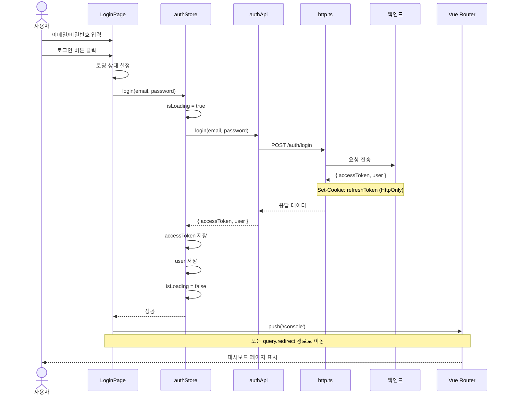
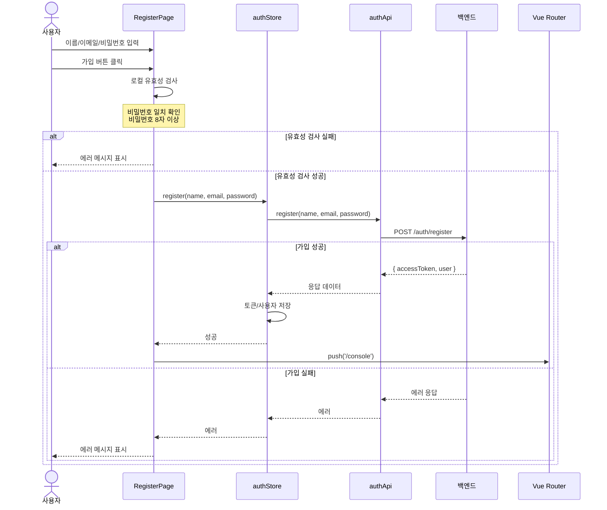
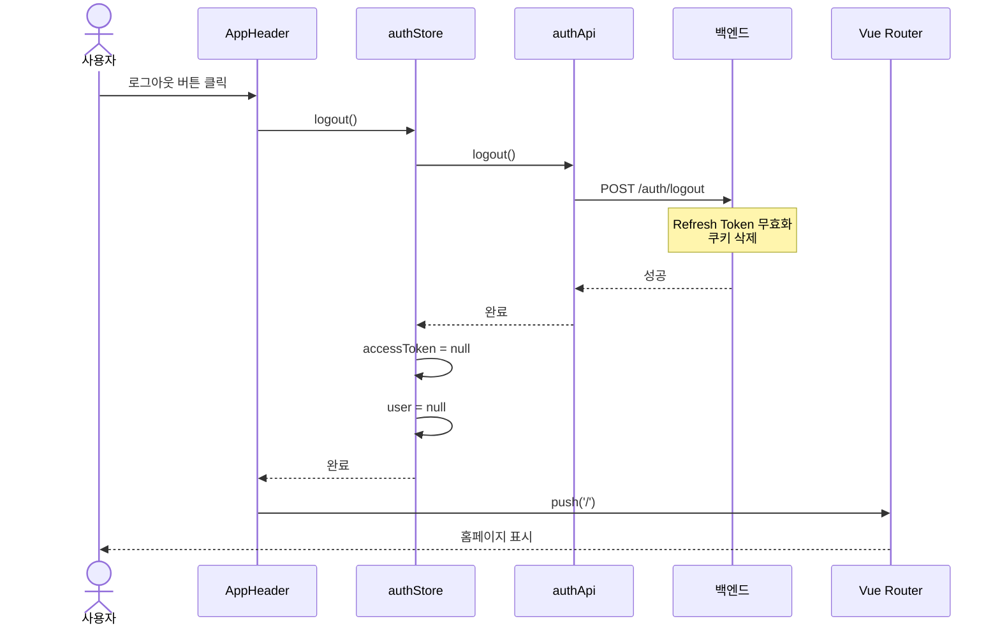
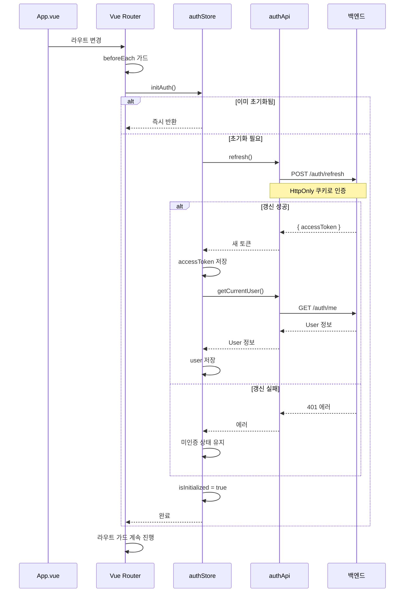
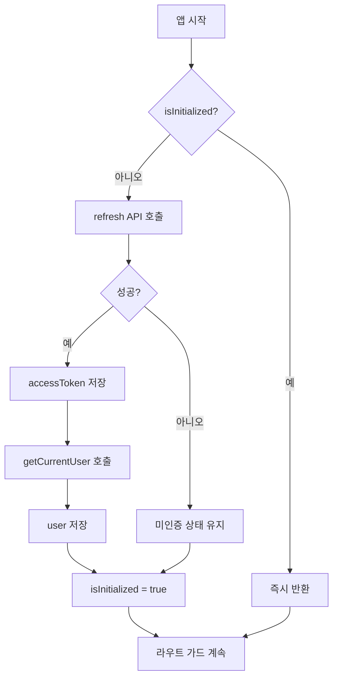
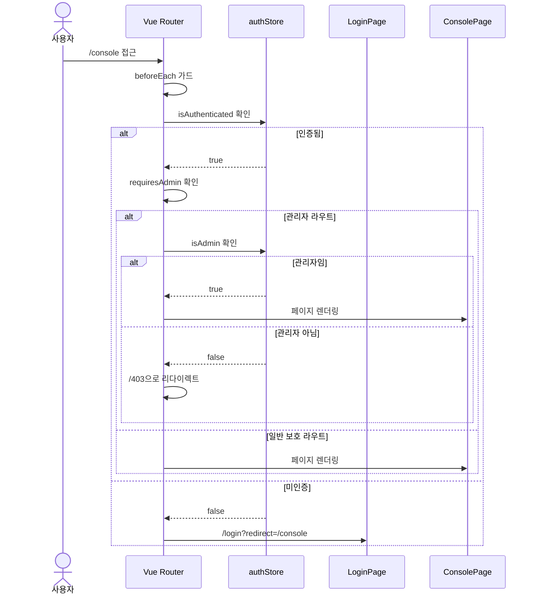
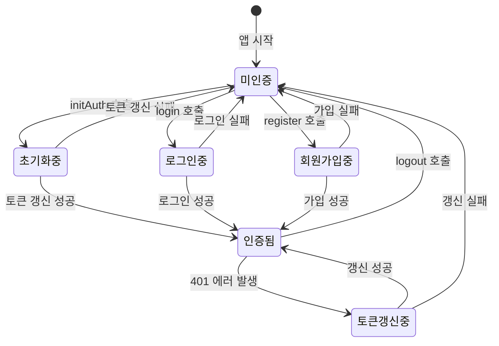

# 인증 프로세스

## 개요

JWT(JSON Web Token) 기반의 인증 시스템입니다. Access Token은 메모리에, Refresh Token은 HttpOnly 쿠키에 저장됩니다.

## 토큰 구조

| 토큰 | 저장 위치 | 만료 시간 | 용도 |
|------|----------|----------|------|
| Access Token | Pinia Store (메모리) | 코드로 확인 불가 | API 요청 인증 |
| Refresh Token | HttpOnly 쿠키 | 코드로 확인 불가 | Access Token 갱신 |

## 로그인 프로세스

### 시퀀스 다이어그램



### 흐름도

```mermaid
flowchart TD
    A[로그인 페이지 접근] --> B[이메일/비밀번호 입력]
    B --> C[로그인 버튼 클릭]
    C --> D{입력값 유효성 검사}
    D -->|실패| E[에러 메시지 표시]
    E --> B
    D -->|성공| F[API 호출]
    F --> G{로그인 성공?}
    G -->|실패| H[에러 메시지 표시]
    H --> B
    G -->|성공| I[토큰 저장]
    I --> J[사용자 정보 저장]
    J --> K{redirect 파라미터 있음?}
    K -->|예| L[redirect 경로로 이동]
    K -->|아니오| M[/console로 이동]
```

### 에러 처리

| 상태 코드 | 원인 | 사용자 메시지 |
|----------|------|-------------|
| 400 | 잘못된 요청 형식 | "이메일과 비밀번호를 입력해주세요" |
| 401 | 인증 실패 | "이메일 또는 비밀번호가 올바르지 않습니다" |
| 429 | 요청 제한 초과 | "잠시 후 다시 시도해주세요" |
| 500 | 서버 오류 | "서버 오류가 발생했습니다" |

## 회원가입 프로세스

### 시퀀스 다이어그램



### 클라이언트 측 유효성 검사

```typescript
// RegisterPage.vue
const validateForm = () => {
  if (password !== confirmPassword) {
    error.value = '비밀번호가 일치하지 않습니다'
    return false
  }
  if (password.length < 8) {
    error.value = '비밀번호는 8자 이상이어야 합니다'
    return false
  }
  return true
}
```

## 로그아웃 프로세스

### 시퀀스 다이어그램



### 로그아웃 흐름도

```mermaid
flowchart TD
    A[로그아웃 버튼 클릭] --> B[authStore.logout 호출]
    B --> C[POST /auth/logout]
    C --> D{API 호출 성공?}
    D -->|성공| E[로컬 상태 정리]
    D -->|실패| E
    Note right of E: 실패해도 로컬 상태는 정리
    E --> F[accessToken = null]
    F --> G[user = null]
    G --> H[홈페이지로 이동]
```

## 앱 초기화 시 인증 복구

페이지 새로고침 시 메모리의 토큰이 손실되므로, 앱 시작 시 토큰 갱신을 시도합니다.

### 시퀀스 다이어그램



### 초기화 흐름도



## 보호된 라우트 접근

### 시퀀스 다이어그램



## 전체 인증 상태 흐름도



## 관련 문서

- [[03-API-모듈]] - 인증 API 상세
- [[04-토큰-갱신-메커니즘]] - 자동 토큰 갱신
- [[05-상태관리-Pinia]] - authStore 구조
- [[02-라우팅-시스템]] - 라우트 가드
