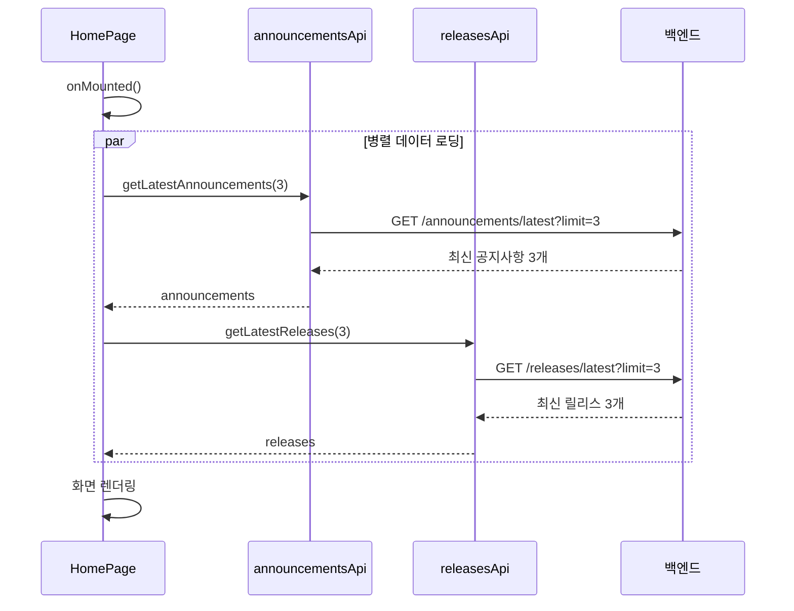
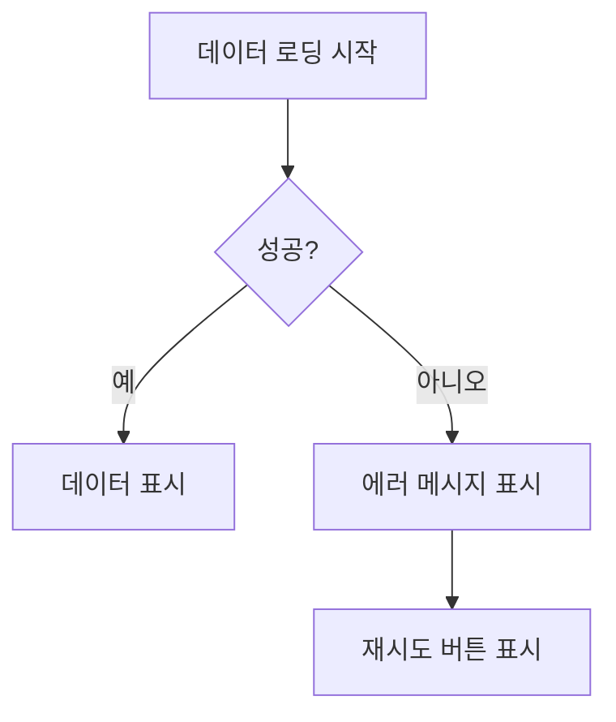
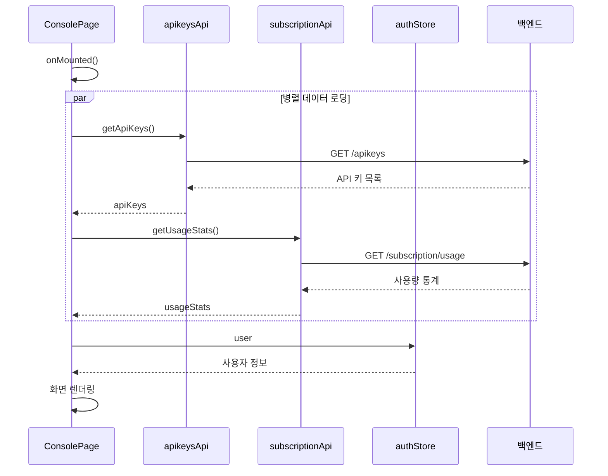
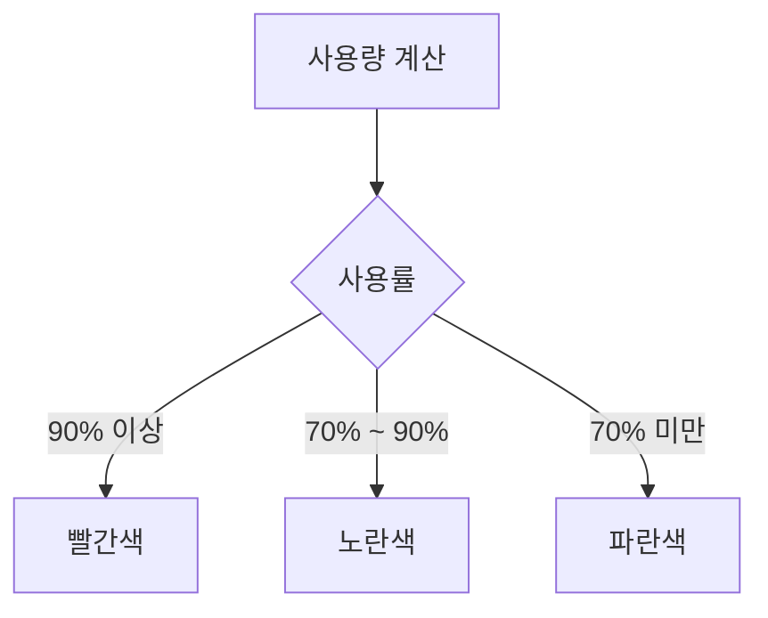
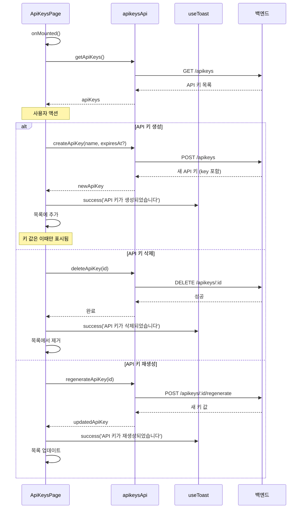
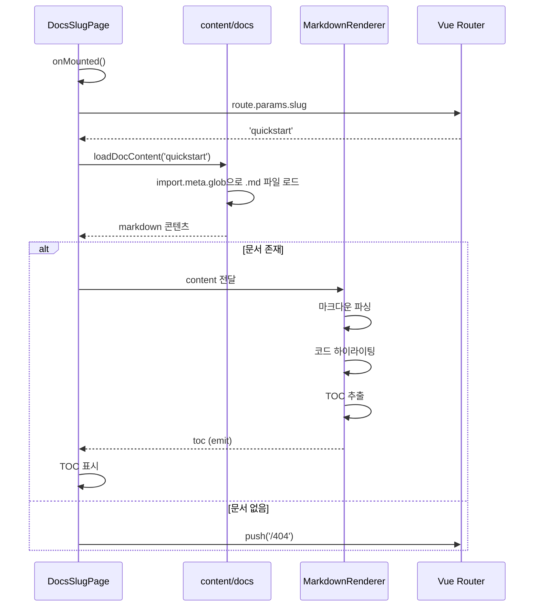
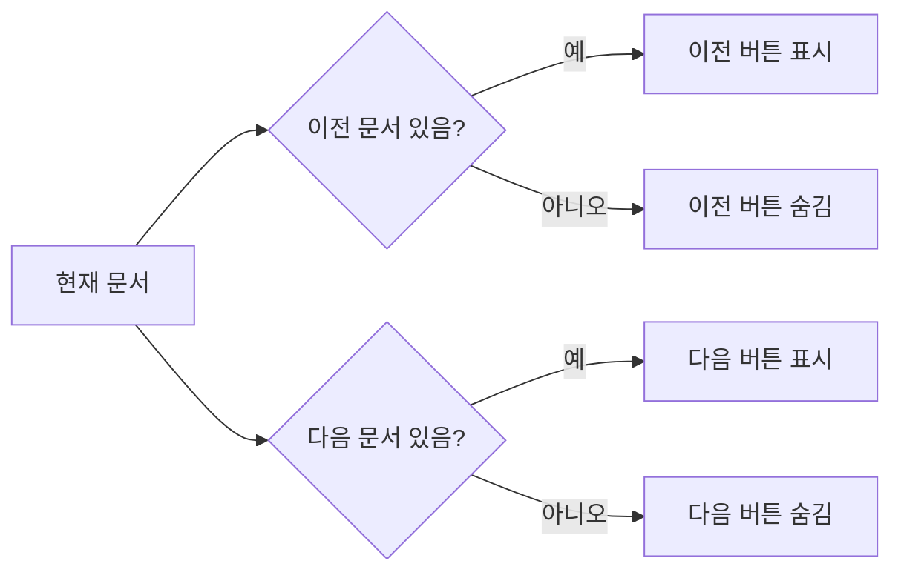
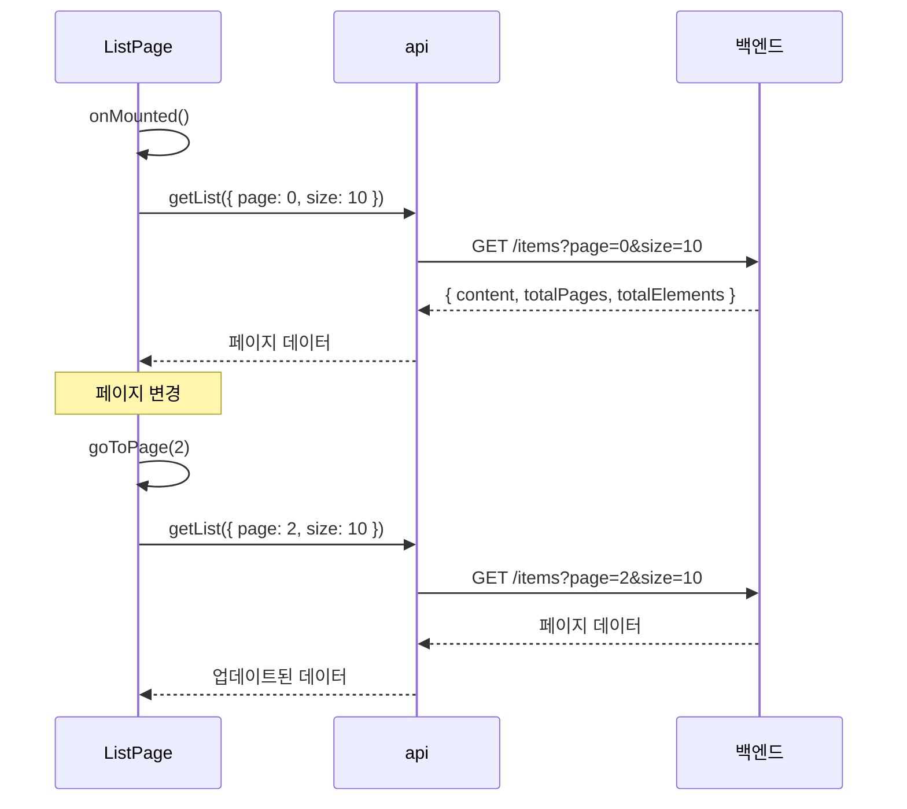
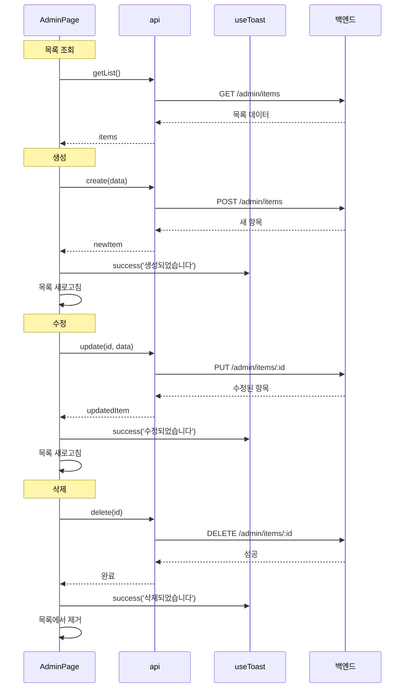
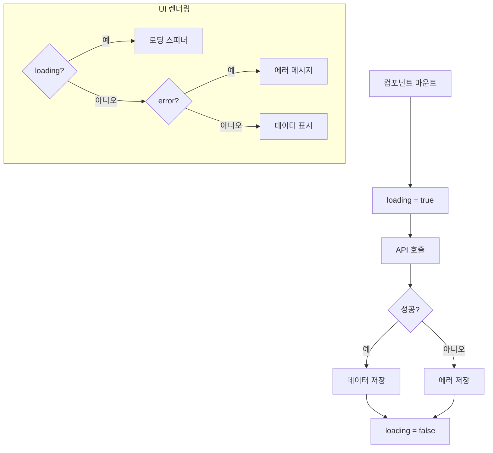

# 페이지별 데이터 흐름

## 개요

주요 페이지들의 데이터 로딩 패턴과 상태 관리 흐름을 설명합니다.

## HomePage (홈 페이지)

### 데이터 흐름



### 상태 관리

```typescript
// 로컬 상태
const announcements = ref<Announcement[]>([])
const releases = ref<Release[]>([])
const loading = ref({ announcements: true, releases: true })
const error = ref({ announcements: null, releases: null })
```

### 에러 처리

각 데이터 소스의 로딩/에러 상태를 독립적으로 관리합니다.



## ConsolePage (대시보드)

### 데이터 흐름



### 표시 데이터

| 섹션 | 데이터 소스 | 표시 내용 |
|------|-----------|----------|
| 환영 인사 | authStore.user | 사용자 닉네임 |
| API Calls Today | usageStats | 오늘 호출 수 / 일일 한도 |
| Active API Keys | apiKeys | API 키 개수 |
| Current Plan | 코드로 확인 불가 | Free (하드코딩 추정) |
| 월간 사용량 | usageStats | 이번 달 호출 수 / 월간 한도 |

### 진행률 바 색상 로직



## ConsoleApiKeysPage (API 키 관리)

### 데이터 흐름



### 상태 관리

```typescript
const apiKeys = ref<ApiKey[]>([])
const loading = ref(true)
const showCreateModal = ref(false)
const newKeyName = ref('')
const newKeyExpiry = ref('')
const createdKey = ref<string | null>(null)  // 생성된 키 (한 번만 표시)
```

## DocsSlugPage (문서 상세)

### 데이터 흐름



### watch를 통한 동적 로딩

```typescript
// route.params.slug 변경 감지
watch(
  () => route.params.slug,
  async (newSlug) => {
    await loadContent(newSlug as string)
  },
  { immediate: true }
)
```

### 이전/다음 문서 네비게이션



## ReleasesPage / AnnouncementsPage (목록 페이지)

### 페이지네이션 데이터 흐름



### 상태 구조

```typescript
interface PageState<T> {
  items: T[]
  loading: boolean
  error: string | null
  pagination: {
    page: number
    size: number
    totalPages: number
    totalElements: number
  }
}
```

## 관리자 페이지 (Admin)

### CRUD 데이터 흐름



### 모달 상태 관리

```typescript
const showModal = ref(false)
const editingItem = ref<Item | null>(null)
const isEditMode = computed(() => editingItem.value !== null)

// 생성 모드
const openCreateModal = () => {
  editingItem.value = null
  showModal.value = true
}

// 수정 모드
const openEditModal = (item: Item) => {
  editingItem.value = item
  showModal.value = true
}
```

## 공통 데이터 로딩 패턴

### 로딩 상태 표시



### 코드 패턴

```typescript
const data = ref<T | null>(null)
const loading = ref(true)
const error = ref<string | null>(null)

onMounted(async () => {
  try {
    data.value = await api.getData()
  } catch (e) {
    error.value = '데이터를 불러오는데 실패했습니다'
  } finally {
    loading.value = false
  }
})
```

## 관련 문서

- [[03-API-모듈]] - API 호출 상세
- [[05-상태관리-Pinia]] - 전역 상태 관리
- [[10-Composables]] - useToast 사용법
