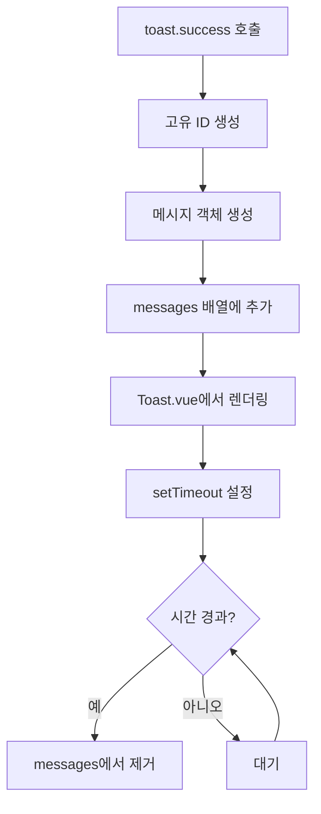
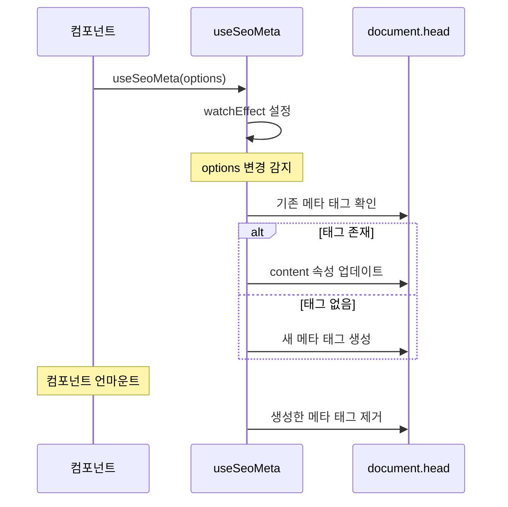

# Composables

## 개요

Vue 3 Composition API를 활용한 재사용 가능한 로직입니다. 여러 컴포넌트에서 공통으로 사용되는 상태와 함수를 캡슐화합니다.

## Composable 목록

```
src/composables/
├── useToast.ts     # 토스트 알림 관리
└── useSeoMeta.ts   # SEO 메타 태그 관리
```

## useToast

토스트 알림을 관리하는 컴포저블입니다.

### 타입 정의

```typescript
interface ToastMessage {
  id: number
  type: 'success' | 'error' | 'warning' | 'info'
  message: string
  duration: number
}

interface UseToast {
  messages: Ref<ToastMessage[]>
  show: (type: ToastType, message: string, duration?: number) => number
  success: (message: string, duration?: number) => number
  error: (message: string, duration?: number) => number
  warning: (message: string, duration?: number) => number
  info: (message: string, duration?: number) => number
  remove: (id: number) => void
  clear: () => void
}
```

### 사용 방법

```typescript
import { useToast } from '@/composables/useToast'

const toast = useToast()

// 성공 메시지 (기본 5초 후 자동 닫힘)
toast.success('저장되었습니다')

// 에러 메시지
toast.error('오류가 발생했습니다')

// 경고 메시지
toast.warning('주의가 필요합니다')

// 정보 메시지
toast.info('참고하세요')

// 커스텀 지속 시간 (밀리초)
toast.success('빠르게 사라집니다', 2000)

// 수동으로 토스트 제거
const id = toast.success('메시지')
toast.remove(id)

// 모든 토스트 제거
toast.clear()
```

### 내부 동작



### 싱글톤 패턴

```typescript
// 전역 상태 공유
const messages = ref<ToastMessage[]>([])
let toastId = 0

export function useToast(): UseToast {
  // 같은 messages 참조 반환
  return {
    messages,
    show,
    success,
    error,
    warning,
    info,
    remove,
    clear
  }
}
```

모든 컴포넌트에서 동일한 `messages` 배열을 공유하므로, 어디서 호출하든 같은 토스트 컨테이너에 표시됩니다.

## useSeoMeta

SEO 메타 태그를 동적으로 관리하는 컴포저블입니다.

### 타입 정의

```typescript
interface SeoMetaOptions {
  title?: string
  description?: string
  keywords?: string
  ogTitle?: string
  ogDescription?: string
  ogImage?: string
  ogUrl?: string
  ogType?: string
  twitterCard?: string
  twitterTitle?: string
  twitterDescription?: string
  twitterImage?: string
  canonical?: string
  noindex?: boolean
}
```

### 사용 방법

```typescript
import { useSeoMeta } from '@/composables/useSeoMeta'

// 기본 사용
useSeoMeta({
  title: '페이지 제목',
  description: '페이지 설명입니다.'
})

// 전체 옵션
useSeoMeta({
  title: 'API 문서',
  description: 'DevAPI의 API 문서입니다.',
  keywords: 'API, 개발, 문서',
  ogTitle: 'DevAPI - API 문서',
  ogDescription: 'DevAPI의 상세 API 문서를 확인하세요.',
  ogImage: 'https://example.com/og-image.png',
  ogUrl: 'https://example.com/docs',
  ogType: 'website',
  twitterCard: 'summary_large_image',
  canonical: 'https://example.com/docs',
  noindex: false
})
```

### 동작 원리



### 메타 태그 매핑

| 옵션 | 메타 태그 |
|------|----------|
| title | `<title>` |
| description | `<meta name="description">` |
| keywords | `<meta name="keywords">` |
| ogTitle | `<meta property="og:title">` |
| ogDescription | `<meta property="og:description">` |
| ogImage | `<meta property="og:image">` |
| ogUrl | `<meta property="og:url">` |
| ogType | `<meta property="og:type">` |
| twitterCard | `<meta name="twitter:card">` |
| twitterTitle | `<meta name="twitter:title">` |
| twitterDescription | `<meta name="twitter:description">` |
| twitterImage | `<meta name="twitter:image">` |
| canonical | `<link rel="canonical">` |
| noindex | `<meta name="robots" content="noindex">` |

### 정리 로직

컴포넌트가 언마운트될 때 생성한 메타 태그를 자동으로 정리합니다.

```typescript
onUnmounted(() => {
  createdElements.forEach(el => el.remove())
})
```

## Composable 사용 패턴

### 페이지 컴포넌트에서

```typescript
// DocsSlugPage.vue
import { useSeoMeta } from '@/composables/useSeoMeta'
import { useToast } from '@/composables/useToast'

const toast = useToast()

// 문서 로드 시 SEO 메타 설정
watch(docMeta, (meta) => {
  if (meta) {
    useSeoMeta({
      title: meta.title,
      description: meta.description
    })
  }
})

// 에러 발생 시 토스트 표시
const loadDoc = async () => {
  try {
    await loadContent()
  } catch (error) {
    toast.error('문서를 불러오는데 실패했습니다')
  }
}
```

### API 호출 후

```typescript
// ConsoleApiKeysPage.vue
const toast = useToast()

const createApiKey = async () => {
  try {
    await apikeysApi.createApiKey(name, expiresAt)
    toast.success('API 키가 생성되었습니다')
  } catch (error) {
    toast.error('API 키 생성에 실패했습니다')
  }
}
```

## 관련 문서

- [[07-공통-컴포넌트]] - Toast.vue 컴포넌트
- [[09-페이지별-데이터-흐름]] - 페이지에서의 사용 예시
