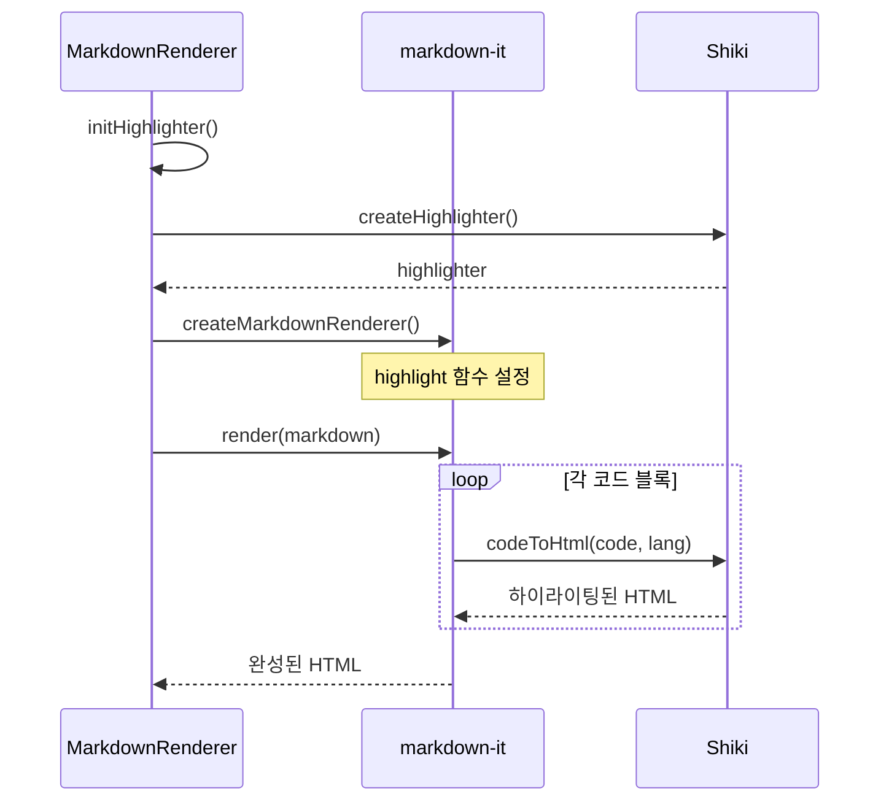
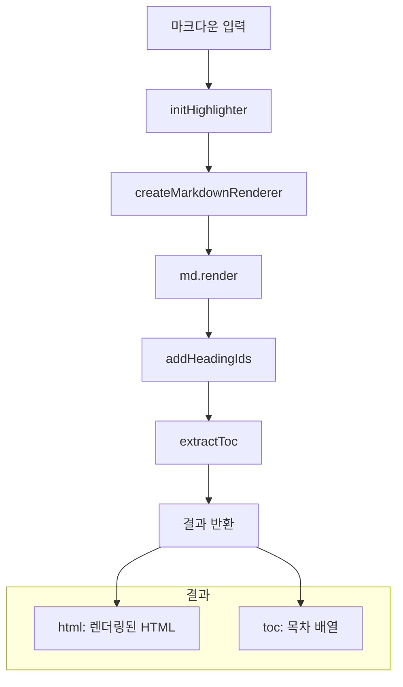
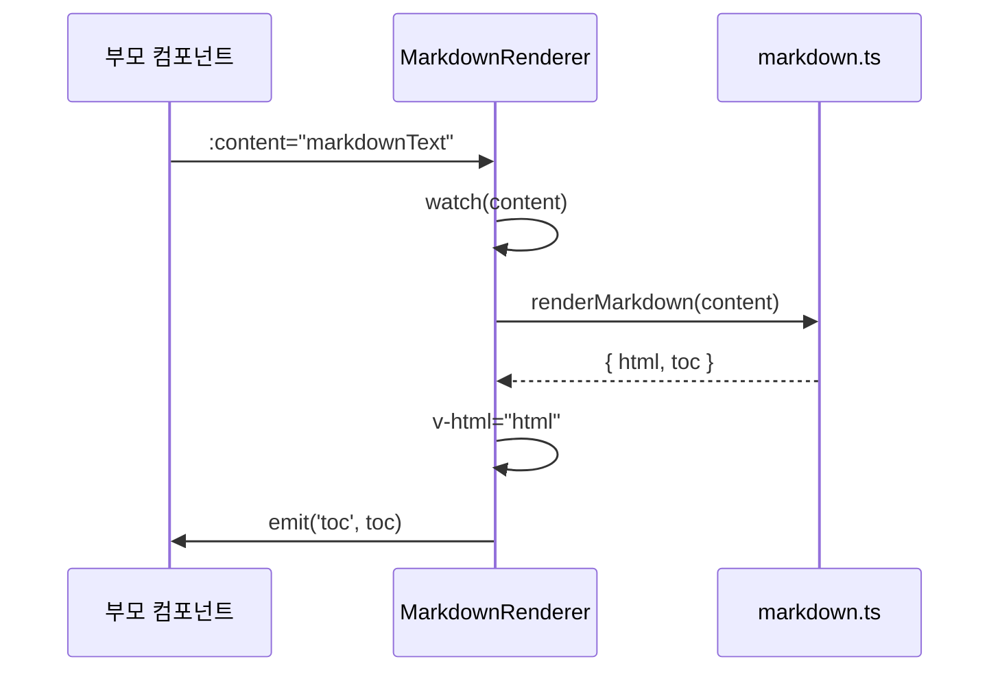
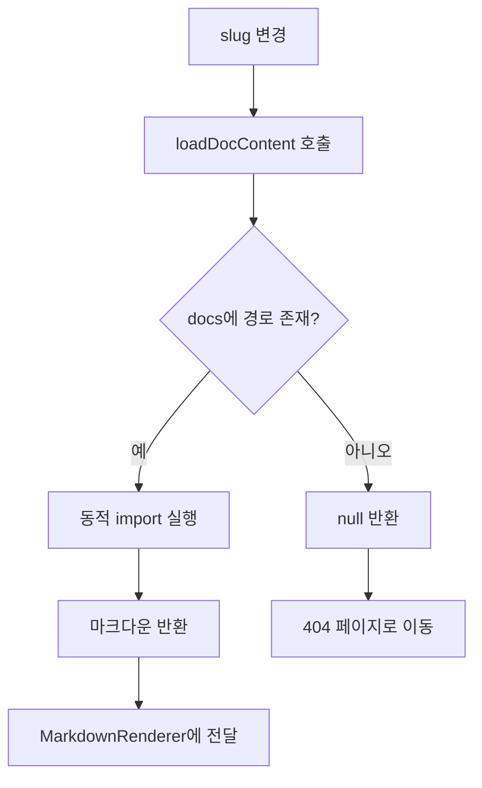

# 마크다운 렌더링

## 개요

markdown-it과 Shiki를 사용하여 마크다운 콘텐츠를 HTML로 렌더링합니다. 코드 구문 강조, 목차 생성, 외부 링크 처리 등의 기능을 제공합니다.

## 구성 요소

```
src/utils/markdown.ts      # 마크다운 유틸리티 함수
src/components/MarkdownRenderer.vue  # 렌더링 컴포넌트
src/content/docs/index.ts  # 문서 메타데이터 및 로더
```

## markdown.ts 유틸리티

### 주요 함수

| 함수 | 설명 |
|------|------|
| `initHighlighter()` | Shiki 하이라이터 초기화 |
| `createMarkdownRenderer()` | MarkdownIt 인스턴스 생성 |
| `addHeadingIds(html)` | 제목에 id 속성 추가 |
| `extractToc(html)` | 목차 항목 추출 |
| `renderMarkdown(content)` | 마크다운을 HTML로 변환 |

### Shiki 하이라이터 초기화

```typescript
let highlighter: Highlighter | null = null

async function initHighlighter() {
  if (highlighter) return highlighter

  highlighter = await createHighlighter({
    themes: ['github-light', 'github-dark'],
    langs: [
      'javascript', 'typescript', 'python', 'java',
      'go', 'rust', 'c', 'cpp', 'html', 'css',
      'json', 'yaml', 'bash', 'shell', 'sql',
      // ... 25개 이상의 언어
    ]
  })

  return highlighter
}
```

### 코드 하이라이팅 흐름



### 테마 지원

| 모드 | Shiki 테마 |
|------|-----------|
| 라이트 모드 | github-light |
| 다크 모드 | github-dark |

테마 전환 시 CSS 변수를 통해 적절한 테마가 적용됩니다.

### 제목 ID 생성

한글을 포함한 제목에도 ID를 자동으로 생성합니다.

```typescript
function addHeadingIds(html: string): string {
  return html.replace(
    /<(h[2-4])>(.*?)<\/h[2-4]>/gi,
    (match, tag, content) => {
      // HTML 태그 제거
      const text = content.replace(/<[^>]+>/g, '')
      // ID 생성 (공백 → 하이픈, 특수문자 제거)
      const id = text
        .toLowerCase()
        .replace(/\s+/g, '-')
        .replace(/[^\w\u3131-\uD79D-]/g, '')
      return `<${tag} id="${id}">${content}</${tag}>`
    }
  )
}
```

예시:
- `## 시작하기` → `<h2 id="시작하기">시작하기</h2>`
- `## Quick Start` → `<h2 id="quick-start">Quick Start</h2>`

### TOC 추출

h2-h4 제목을 추출하여 목차 데이터를 생성합니다.

```typescript
interface TocItem {
  id: string
  text: string
  level: number  // 2, 3, 4
}

function extractToc(html: string): TocItem[] {
  const toc: TocItem[] = []
  const regex = /<h([2-4]) id="([^"]+)">(.*?)<\/h[2-4]>/gi

  let match
  while ((match = regex.exec(html)) !== null) {
    toc.push({
      level: parseInt(match[1]),
      id: match[2],
      text: match[3].replace(/<[^>]+>/g, '')  // 태그 제거
    })
  }

  return toc
}
```

### 전체 렌더링 흐름



## MarkdownRenderer 컴포넌트

### Props

| Prop | 타입 | 필수 | 설명 |
|------|------|------|------|
| content | string | 예 | 마크다운 텍스트 |

### Emits

| Event | Payload | 설명 |
|-------|---------|------|
| toc | TocItem[] | 추출된 목차 |

### 컴포넌트 동작



### 코드 복사 기능

코드 블록에 복사 버튼을 자동으로 추가합니다.

```typescript
// 렌더링 후 처리
onMounted(() => {
  addCopyButtons()
})

function addCopyButtons() {
  const codeBlocks = document.querySelectorAll('pre code')

  codeBlocks.forEach(block => {
    const button = document.createElement('button')
    button.textContent = 'Copy'
    button.onclick = () => {
      navigator.clipboard.writeText(block.textContent || '')
      button.textContent = 'Copied!'
      setTimeout(() => button.textContent = 'Copy', 2000)
    }
    block.parentElement?.appendChild(button)
  })
}
```

## 문서 콘텐츠 로더

### 문서 구조

```typescript
// content/docs/index.ts
interface DocMeta {
  slug: string
  title: string
  description: string
}

interface DocSection {
  title: string
  docs: DocMeta[]
}

const docsSections: DocSection[] = [
  {
    title: 'Getting Started',
    docs: [
      { slug: 'quickstart', title: 'Quickstart', description: '빠르게 시작하기' },
      { slug: 'authentication', title: 'Authentication', description: '인증 방법' }
    ]
  },
  {
    title: 'Core Concepts',
    docs: [
      { slug: 'api-usage', title: 'API Usage', description: 'API 사용법' },
      { slug: 'rate-limits', title: 'Rate Limits', description: '요청 제한' },
      { slug: 'errors', title: 'Errors', description: '에러 처리' }
    ]
  },
  {
    title: 'Resources',
    docs: [
      { slug: 'faq', title: 'FAQ', description: '자주 묻는 질문' }
    ]
  }
]
```

### 동적 문서 로딩

```typescript
// Vite의 import.meta.glob 사용
const docs = import.meta.glob('./docs/*.md', { as: 'raw' })

async function loadDocContent(slug: string): Promise<string | null> {
  const path = `./docs/${slug}.md`

  if (docs[path]) {
    const content = await docs[path]()
    return content
  }

  return null
}
```

### 로딩 흐름



## 스타일링

### 마크다운 기본 스타일

Tailwind Typography 플러그인(`@tailwindcss/typography`)을 사용합니다.

```html
<article class="prose dark:prose-invert max-w-none">
  <div v-html="html"></div>
</article>
```

### 코드 블록 스타일

```css
/* main.css */
pre {
  position: relative;
  overflow-x: auto;
}

pre code {
  font-family: 'Fira Code', monospace;
  font-size: 0.875rem;
  line-height: 1.7;
}

/* 복사 버튼 */
pre .copy-button {
  position: absolute;
  top: 0.5rem;
  right: 0.5rem;
  padding: 0.25rem 0.5rem;
  font-size: 0.75rem;
  background: rgba(255, 255, 255, 0.1);
  border-radius: 0.25rem;
}
```

## 지원 언어 목록

Shiki를 통해 다음 언어들의 구문 강조를 지원합니다:

| 카테고리 | 언어 |
|---------|------|
| 웹 | JavaScript, TypeScript, HTML, CSS, Vue, React |
| 백엔드 | Python, Java, Go, Rust, C, C++, C# |
| 데이터 | JSON, YAML, XML, SQL |
| 스크립트 | Bash, Shell, PowerShell |
| 기타 | Markdown, Dockerfile, GraphQL |

## 관련 문서

- [[07-공통-컴포넌트]] - MarkdownRenderer 컴포넌트
- [[09-페이지별-데이터-흐름]] - DocsSlugPage의 문서 로딩
